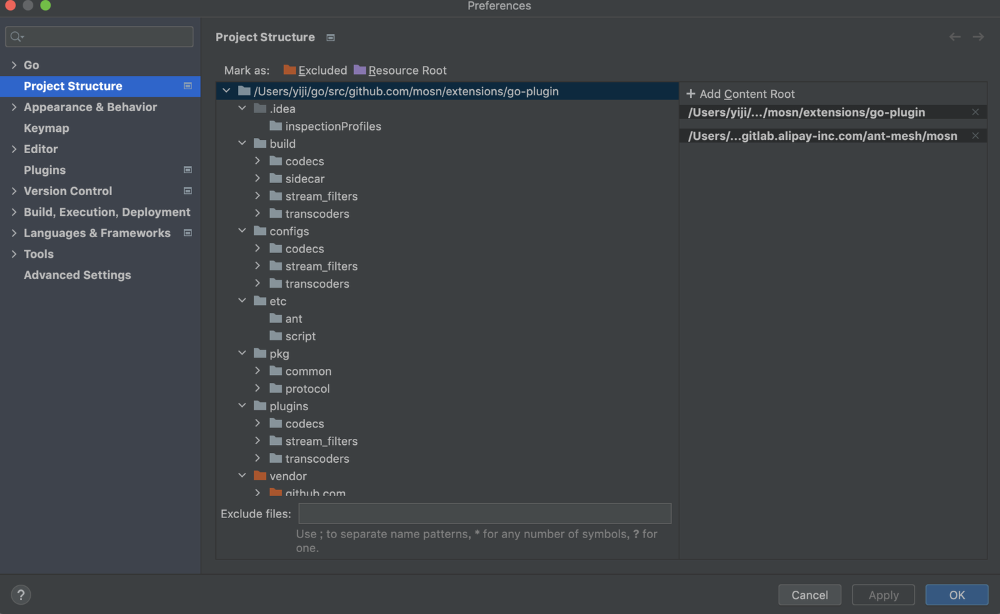
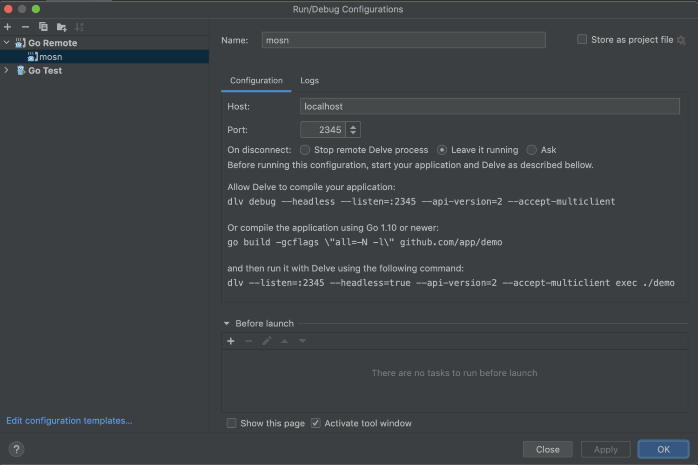
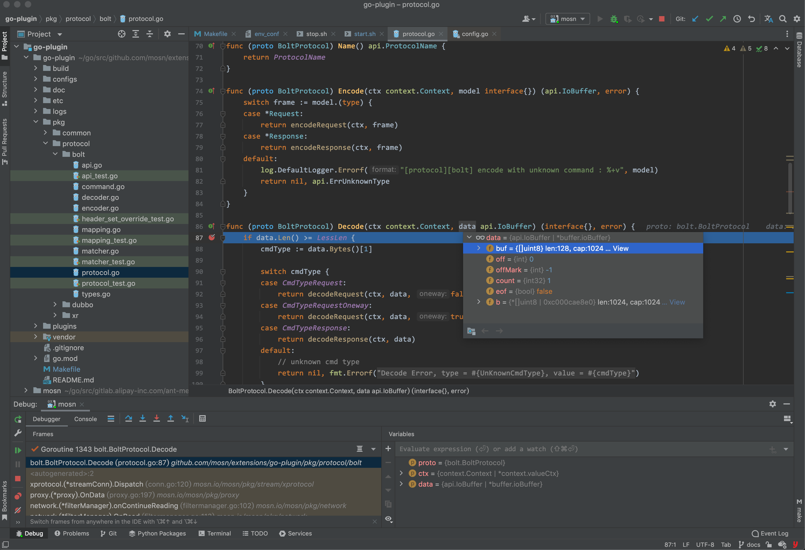

文档修订历史

| 版本号 | 作者 | 备注     | 修订日期  |
| ------ | ---- | -------- | --------- |
| 0.1    | [诣极](https://github.com/zonghaishang) | 初始版本 | 2022.1.12 |

# 1. 插件基础篇

推荐厂商所有插件代码，放到到同一个脚手架仓库(go-plugin)，方便后续统一打包升级和运维。

## 1.1 环境准备

源码主要包括mosn和插件脚手架工程代码。

- mosn源码：商业版mosn代码，分支master_cloud，用于本地编译调试信息。
- 插件代码：用于编写厂商扩展代码，脚手架内已经包含标准演示程序。

运行mosn和开发插件前置条件(mac)：

- 确保[docker](https://www.docker.com/get-started) 已经安装
- 确保[golang ](https://go.dev/learn/) 已经安装
- 推荐[goland ide](https://www.jetbrains.com/zh-cn/go/download/#section=mac) 已经安装

### 1.1.1 mosn源码

假设商业版mosn源码和脚手架源码都放在标准go的path目录。查看本地go path(简称GOPATH)路径命令：

```bash
go env | grep GOPATH
# 输出类似: GOPATH="/Users/yiji/go"
```

获取商业版mosn源代码，需要内网权限(todo：待补充)：

```bash
# 1. 创建mosn项目路径
mkdir -p $GOPATH/src/gitlab.alipay-inc.com/ant-mesh/
# 2. 进入商业版mosn源码路径
cd $GOPATH/src/gitlab.alipay-inc.com/ant-mesh/
# 3. clone 代码
git clone https://gitlab.alipay-inc.com/ant-mesh/mosn.git
# 4. 切换到目标release tag: v1.26.1-plugin
git checkout -b v1.26.1-plugin v1.26.1-plugin
```

获取到商业版mosn源码，可以方便本地源码调试。本地开发可以使用脚手架内的可执行mosn二进制文件，也可以手动编译mosn获取最新的可执行文件，如何编译会在接下来小节介绍。

### 1.1.2 插件源码

获取脚手架代码，目前extensions项目包括插件扩展和wasm扩展，插件扩展代码在extensions/go-plugin目录中：

```bash
# 1. 创建脚手架项目路径
mkdir -p $GOPATH/src/mosn.io/
# 2. 进入脚手架项目路径
cd $GOPATH/src/mosn.io/
# 3. clone 代码
git clone https://github.com/mosn/extensions.git
```

如果是fork开源脚手架代码进行扩展开发，需要把第3步骤git clone代码地址换成fork后的私有仓库地址。

举例: github id用户zonghaishang fork脚手架代码配置步骤：

```bash
# 1. 进入脚手架项目路径
cd $GOPATH/src/mosn.io/
# 2. clone fork 后的新代码
git clone https://github.com/zonghaishang/extensions.git
```

开发者可以用Intellij Idea打开go-plugin目录即可，暂时不用关心extensions里面的wasm目录。

### 1.1.3 插件介绍

目前插件脚手架工程内置了标准演示程序，包括协议扩展、协议转换和拦截器功能扩展示例。同时支持插件编译、调试和打包整套流程能力，允许本地一键开箱debug mosn和插件。

目前插件开发者主要关心pkg、plugins、configs和build目录。

- pkg 按照标准mosn api进行编写协议插件
- plugins 编写拦截器和协议转换插件代码，以及load插件的胶水代码
- configs 提供插件对应的配置和metadata.json文件
- build 通过脚手架执行make编译、打包后自动输出so和zip插件包

开发者在本地开发插件，只需要在本地编译插件后，通过容器化方式加载本地插件，通过Intellij Idea调试即可。在功能测试完成后，如果要在正式环境中使用(预发、生产)，可以通过脚手架提供的打包能力，把插件上传并通过控制台配置激活即可。

开发者如何在本地开发、编译和调试会在接下来小节介绍。


## 1.2 编译调试

接下来介绍如何编译带调试符号的mosn，以及编译插件代码。

### 1.2.1 编译mosn

有2种途径得到mosn可执行文件, 通过源码编译或者使用预编译好的压缩包文件。

从脚手架项目`go-plugin/etc/bundle/mosn.zip`解压缩放入到`build/sidecar/binary`中。

解压缩后的mosn文件结构：

```shell
build
├── sidecar
   └── binary
       ├── mosn
       └── mosn-1.26.0-5ecd61124.md5
```

**说明**：商业版mosn.zip不允许放置开源，可以联系邀明或者诣极获取mosn.zip文件。

或者在脚手架根目录编译：
```bash
# 1. 进入脚手架项目根目录
cd $GOPATH/src/mosn.io/extensions/go-plugin
# 2. 执行mosn编译, 编译后在build/sidecar/binary目录输出可执行文件mosn
make ant
```

### 1.2.2 编译插件

以下编译命令执行都在go-plugin根项目中执行，编译插件语法：

```bash
make [codec|filter|trans] plugin=[plugin-name]
# 取值codec: 代表编译协议插件
# 取值filter: 代表编译拦截器插件
# 取值trans: 代表编译协议转换插件

# plugin-name:
# 代表插件的名称, 当编译类型取值为filter或者trans时，允许以逗号分隔指定多个插件名称，脚手架同时编译多个插件
# 当编译类型取值为filter时，逗号分隔的插件名称代表拦截器执行的先后顺序
```

编译示例，比如编译bolt协议插件：

```bash
make codec plugin=bolt
# 编译后在build/codecs目录下输出so和配置
└── bolt
    ├── codec-bolt.md5
    ├── codec-bolt.so
    ├── egress_bolt.json
    ├── ingress_bolt.json
    ├── metadata.json
    └── mosn_config.json

1 directory, 6 files
```

编译拦截器插件, 以简单鉴权拦截器auth为例：

```bash
make filter plugin=auth
#  编译后在build/stream_filters目录下输出so和配置
└── auth
    ├── egress_config.json
    ├── filter-auth.md5
    ├── filter-auth.so
    ├── metadata.json
    └── mosn_config.json

1 directory, 5 files
```

编译协议转换插件，以bolt转springcloud插件bolt2springcloud为例：

```bash
make trans plugin=bolt2springcloud
#  编译后在build/transcoders目录下输出so和配置
└── bolt2springcloud
    ├── egress_config.json
    ├── metadata.json
    ├── transcoder-bolt2springcloud.md5
    └── transcoder-bolt2springcloud.so

1 directory, 4 files
```

可以组合编译，让拦截器或者协议转换插件挂载到指定协议生效，比如：

```bash
# 1. 把拦截器插件auth挂载到bolt协议扩展中
make codec plugin=bolt filter=auth

# 2. 把协议转换插件bolt2springcloud挂载到bolt协议扩展中
make codec plugin=bolt trans=bolt2springcloud

# 3. 也允许同时挂载拦截器auth插件、协议转换插件bolt2springcloud到bolt协议扩展中
make codec plugin=bolt filter=auth trans=bolt2springcloud
```

注意：示例中auth插件要求请求头中包含`User`:`admin` 信息，否则请求会被拦截。

为了精简编译命令，比如make codec plugin=bolt filter=auth trans=bolt2springcloud可以同时完成auth插件、bolt2springcloud插件编译。

如果需要清除所有已经编译的插件，执行clean命令：

```bash
make clean
```

**交叉编译支持：**

- 支持显示指定目标交叉参数(arm64/amd64)

```
GOOS=linux GOARCH=amd64 make codec plugin=bolt
```

或者另外一种简写：

```shell
make codec.amd64 plugin=bolt
```

> apple m1 chip(arm64) 打包阶段自动触发编译amd64架构插件

在苹果mac m1 芯片一下命令，打包阶段自动重新编译linux amd64架构插件，方便公共一套linux sidecar容器。
```shell
make pkg-codec plugin=bolt
```

如果需要明确交叉编译插件，比如arm64插件，可以执行以下命令：

```shell
make pkg-codec.arm64 plugin=bolt
```

该命令等价于:

```shell
GOOS=linux GOARCH=arm64 DOCKER_BUILD_OPTS="--platform=linux/arm64" make pkg-codec plugin=bolt
```

- DOCKER_BUILD_OPTS 是传递给docker的编译参数，需要和传递给go `os/arch`架构一致。

### 1.2.3 编译调试

以下命令执行都在go-plugin根项目中执行，启动mosn调试命令：

```bash
make debug
# 启动后，终端输出以下提示信息：
# start mosn-container container success.
# run 'docker exec -it mosn-container /bin/bash' command enter mosn container.
```

注意：make debug 之后，mosn会监听2345端口，并且阻塞直到有远程调试行为, 接下来会介绍。make debug可以反复执行，重复执行会自动停止正在运行的mosn，nice~。

在扩展新的协议时，开发者在mosn侧为协议listener分配了新的端口, 需要在脚手架启动脚本追加端口，正确让容器做映射。操作如下：

```bash
# go-plugin根目录etc/ant/start.sh行追加新分配的端口, 格式 -p port:port
# BIZ_PORTS="-p 13088:13088 -p 13080:13080"

```

如果需要调试mosn的源代码，可以把商业版mosn的源代码配置到脚手架中。操作步骤：

1. 在go-plugin项目中(`goland菜单`-> `Perferences...`->`Project Structure`-> `Add Content Root`)，选择商业版mosn代码根目录，如下图所示：



2. 在goland中新建一个远程调试配置， `Edit Configuratons...` -> `Go remote`，On Disconnect选择`Leave it runing`。

   

3. 配置好远程调试后，在插件代码打好断点(在2.1小节介绍bolt调试)，点击Debug mosn按钮即可



提示：为了提示本地排查效率，go-plugin根目录挂载了logs容器日志目录, 方便不进容器查看容器日志, nice~。

**说明：** 如果无需调试mosn和插件，可以执行启动命令：
```shell
make start
# 启动后，终端输出以下提示信息：
# start mosn-container container success.
# run 'docker exec -it mosn-container /bin/bash' command enter mosn container.
```

### 1.2.4 插件打包

接下来介绍如何在本地打包插件代码，方便后续正式环境使用。和编译插件类似，以下打包命令执行都在go-plugin根项目中执行，打包插件语法：

```bash
make pkg-[codec|filter|trans] plugin=[plugin-name]
# 取值codec: 代表打包协议插件
# 取值filter: 代表打包拦截器插件
# 取值trans: 代表打包协议转换插件

# plugin-name:
# 代表插件的名称, 当打包类型是filter或者trans时，允许以逗号分隔指定多个插件名称，脚手架同时打包多个插件
```

和编译插件区别，在模块前缀加了pkg前缀标识打包，用来将插件打包成.zip文件，用于在控制台上传。

比如打包bolt协议插件：

```bash
make pkg-codec plugin=bolt
# 编译后在build/target/codecs目录下输出bolt.zip
└── bolt.zip

0 directories, 1 file
```

打包拦截器插件, 以简单鉴权拦截器auth为例：

```bash
make pkg-filter plugin=auth
#  编译后在build/target/stream_filters目录下输出auth.zip
└── auth.zip

0 directories, 1 file
```

打包协议转换插件，以bolt转springcloud插件bolt2springcloud为例：

```bash
make pkg-trans plugin=bolt2springcloud
#  编译后在build/target/transcoders目录下输出bolt2springcloud.zip
└── bolt2springcloud.zip

0 directories, 1 file
```
