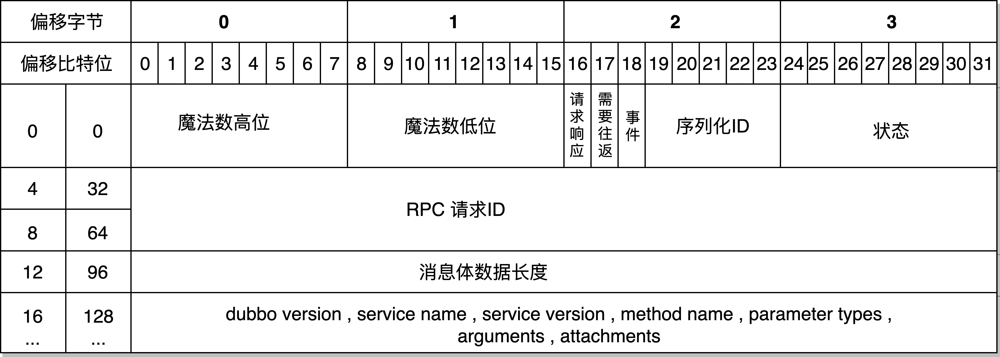

文档修订历史

| 版本号 | 作者 | 备注     | 修订日期  |
| ------ | ---- | -------- | --------- |
| 0.1    | 诣极 | 初始版本 | 2022.1.18 |


## 2.2 动手实现标准dubbo协议扩展

在这个小节主要介绍如何使用插件扩展dubbo协议实现，并且用mosn代理协议通讯。在开始编写前，我们先展示编写完成后的目录结构：

```bash
// go-plugin插件仓库根目录
├── configs
│   └── codecs					// 目录下存储具体协议相关配置, eg: dubbo
│       └── dubbo
│           ├── egress_dubbo.json		// 客户端sidecar发送流量配置
│           ├── ingress_dubbo.json		// 服务端sidecar接收流量配置
│           ├── metadata.json			// 协议插件元数据配置，比如协议字段映射、依赖版本信息
├── pkg
│   └── protocol				// 目录下存储具体协议编码实现，eg: dubbo
│       └── dubbo
│           ├── api.go
│           ├── command.go			// 协议请求/响应对应的model
│           ├── decoder.go			// 解码实现
│           ├── encoder.go			// 编码实现
│           ├── mapping.go			// 状态码映射
│           ├── matcher.go			// 协议报文识别，eg: check是否是dubbo报文
│           ├── protocol.go			// 协议api实现，eg: 是否支持心跳等
│           └── types.go
└── plugins
    └── codecs					// 目录下存储激活插件入口代码，eg: dubbo
          └── dubbo
              └── main				// go插件规范，需要package为main
                  └── codec.go
```

dubbo是标准dubbo框架的内置协议，网络报文头部包含整数类型Id关联请求和响应，已经满足标准mosn接口[规范](https://github.com/mosn/api/blob/master/xprotocol.go#L106) ，主要关注3块：

- configs 包括插件配置信息，**协议插件配置**都应该存储在codecs目录中
- pkg 包含插件满足mosn api接口的代码实现，**协议插件代码**应该放到protocol目录中
- plugins 包含插件激活代码，协议**插件激活代码**都应该存储在codecs目录中

### 2.2.1 编解码实现

在处理请求和响应流程中，开发者需要实现`XProtocol`接口, 在该接口中包含`Protocol` 接口，它负责真正的编解码实现：

- Encoder 负责将请求/响应对象编码成网络二进制流
- Decoder 负责将网络二进制流解码成请求/响应对象

```go
type Protocol interface {
	// Encoder is the encoder implementation of the protocol
	Encoder
	// Decoder is the decoder implementation of the protocol
	Decoder
	// Name is the  name of the protocol
	Name() ProtocolName
}

type Encoder interface {
	// Encode encodes a model to binary data
	// return 1. encoded bytes 2. encode error
	Encode(ctx context.Context, model interface{}) (IoBuffer, error)
}

type Decoder interface {
	// Decode decodes binary data to a model
	// pass sub protocol type to identify protocol format
	// return 1. decoded model(nil if no enough data) 2. decode error
	Decode(ctx context.Context, data IoBuffer) (interface{}, error)
}
```

注意：在Decode流程中，完成解码**必须调用**`data.Drain(frameLen)`, `frameLen`代表完整请求或者报文总长度。

开发者在编写编解码时，建议采用协议名+Protocol命名，比如dubbo编解码，命名为[DubboProtocol](https://github.com/mosn/extensions/blob/master/go-plugin/pkg/protocol/dubbo/protocol.go) 。

目前提供了示例编解码实现，请参考[dubbo编码](https://github.com/mosn/extensions/blob/24a1726f6f2687f864146abedf72efdc12c420c0/go-plugin/pkg/protocol/dubbo/protocol.go#L65) 和[dubbo解码](https://github.com/mosn/extensions/blob/24a1726f6f2687f864146abedf72efdc12c420c0/go-plugin/pkg/protocol/dubbo/protocol.go#L76) 示例。

### 2.2.2 编解码对象

所谓编解码对象，其实就是承载协议的请求/响应的结构体描述，比如dubbo的协议格式定义：



编解码对象实际上就是标识协议各个字段含义，如果需要了解个字段含义，请参考表2-1所示：


| 偏移比特位 | 字段描述     | 作用                                                         |
| :--------- | :----------- | :----------------------------------------------------------- |
| 0~7        | 魔数高位     | 存储的是魔法数高位(0xda00)                                   |
| 8~15       | 魔数低位     | 存储的是魔法数高位(0xbb)                                     |
| 16         | 数据包类型   | 是否双向的rpc调用(比如方法调用有返回值)，0-Response, 1-Request |
| 17         | 调用方式     | 仅在第16位被设为1的情况下有效，0-单向调用，1-双向调用。      |
| 18         | 事件标识     | 0-当前数据包是请求或响应包，1-当前数据包是心跳包             |
| 19~23      | 序列化器编号 | 2 - Hessian2Serialization  <p><p> 3 - JavaSerialization <p> 4 - CompactedJavaSerialization <p> 6 - FastJsonSerialization <p> 7 - NativeJavaSerialization <p> 8 - KryoSerialization <p> 9 - FstSerialization |
| 24~31      | 状态         | 20 - OK <p> <p> 30 - CLIENT_TIMEOUT <p> 31 - SERVER_TIMEOUT <p> 40 - BAD_REQUEST <p> 50 - BAD_RESPONSE <p> ...... |
| 32-95      | 请求编号     | 这8个字节存储rpc请求的唯一id，用来将请求和响应做关联         |
| 96~127     | 消息体长度   | 4个字节存储消息体长度。在一次rpc请求，消息体中依次会存储7部分内容 |

表2-1 dubbo协议字段含义

- 请求对象： 主要包括请求(request-response)、请求(oneway)、心跳类型

- 响应对象： 主要包括响应请求结果对象

请求结构体描述除了表达request-response模型、oneway和心跳，也会承载超时等属性，与之对应响应会承载响应状态码。

请求和响应的结构体描述应该分别实现`api.XFrame`和`api.api.XRespFrame` 接口，接口定义：

```go
type XFrame interface {
	Multiplexing

	HeartbeatPredicate

	// GetTimeout returns a number means Milliseconds for protocol timeout
	// If no timeout defines, returns zero means default timeout
	// If returns a negative number, means never timeout
	GetTimeout() int32

	GetStreamType() StreamType

	GetHeader() HeaderMap

	GetData() IoBuffer

	SetData(data IoBuffer)
}

type XRespFrame interface {
	XFrame

	GetStatusCode() uint32
}
```

请求和响应一般都包括header和body两部分，`GetStreamType` 标识报文是请求还是响应。值的注意的地方：

- `Multiplexing` 接口标识请求和响应id之间的映射，同一个tcp连接知道具体的id是不是一对请求和响应
- `GetData` 和 `SetData` 一般是业务数据(比如业务参数、框架数据)，**并不包括协议头部分**，比如只包含`arguments + attachments` 。

目前提供了dubbo示例编解码对象结构体实现, dubbo用一个struct同时表示请求和响应，请参考[command](https://github.com/mosn/extensions/blob/master/go-plugin/pkg/protocol/dubbo/command.go).

### 2.2.3 心跳处理

mosn支持了协议层级的心跳处理，在`2.2.1` 小节中开发者实现的`XProtocol`接口,它包含`Heartbeater` 接口，它负责心跳处理的约定，当然如果协议本身不需要支持心跳逻辑，`Heartbeater#Trigger`实现返回nil即可，并且跳过本小节阅读。

心跳处理逻辑：

- Trigger构造**心跳请求**： 根据requestId构造协议请求对象
- Reply构造**心跳响应**：根据协议心跳请求对象返回对应的心跳响应，响应的id要和请求的requestId相同

```go
type Heartbeater interface {
	// Trigger builds an active heartbeat command
	Trigger(context context.Context, requestId uint64) XFrame

	// Reply builds heartbeat command corresponding to the given requestID
	Reply(context context.Context, request XFrame) XRespFrame
}
```

因为dubbo协议需要支持心跳，保持tcp长连接活跃, 但是当前未实现请求，仅实现了心跳响应，请参考标准dubbo的[心跳请求](https://github.com/mosn/extensions/blob/master/go-plugin/pkg/protocol/dubbo/protocol.go#L93) 和[心跳响应](https://github.com/mosn/extensions/blob/24a1726f6f2687f864146abedf72efdc12c420c0/go-plugin/pkg/protocol/dubbo/protocol.go#L98) 示例。

### 2.2.4 请求劫持

在service mesh场景中，mesh在转发过程中可能失败，也可能被控制面拦截，比如限流熔断，需要协议层构造并返回响应。

在`2.2.1` 小节中开发者实现的`XProtocol`接口,它包含`Hijacker` 接口：

- Hijack 根据请求、异常状态码构造异常响应
- Mapping 将标准mosn http状态码转换成扩展协议可以理解的响应状态码

```go
type Hijacker interface {
	// BuildResponse build response with given status code
	Hijack(context context.Context, request XFrame, statusCode uint32) XRespFrame

	// Mapping the http status code, which used by proxy framework into protocol-specific status
	Mapping(httpStatusCode uint32) uint32
}
```

开发者应该在`Hijack` 根据请求构造异常响应报文。请参考标准dubbo的[响应劫持构造](https://github.com/mosn/extensions/blob/24a1726f6f2687f864146abedf72efdc12c420c0/go-plugin/pkg/protocol/dubbo/protocol.go#L114) 和[状态码转换](https://github.com/mosn/extensions/blob/24a1726f6f2687f864146abedf72efdc12c420c0/go-plugin/pkg/protocol/dubbo/protocol.go#L138) 示例，dubbo协议在Hijack中实现的状态码映射(http状态码转dubbo协议状态码)，因此Mapping直接返回http的状态码。

### 2.2.5 协议Codec

如果需要激活协议插件，协议扩展开发者需要实现`api.XProtocolCodec` ，它起到关键的桥接作用。

- 负责创建`api.XProtocol` 实例，从而具备协议编解码、心跳处理和请求劫持等能力
- 协议报文识别(matcher, 在透明劫持等场景识别流量)，协议状态码转换成标准http状态码能力
- 提供go-plugin so加载入口函数

```go
type XProtocolCodec interface {
	ProtocolName() ProtocolName

	// If a protocol is stateless, the NewXProtocol is recommended return a singleton.
	// If a protocol is stateful, the NewXProtocol create a protocol instance for each connection.
	// The context.Context can provide some configuartion for create protocol instance.
	NewXProtocol(context.Context) XProtocol

	ProtocolMatch() ProtocolMatch

	HTTPMapping() HTTPMapping
}
```

其中`NewXProtocol` 就是对应`2.2.1`~`2.2.4`小节的协议实现，在此不再重复赘述。接下来主要介绍协议mather和状态码映射：

```go
// ProtocolMatch recognize if the given data matches the protocol specification or not
ProtocolMatch func(data []byte) MatchResult

// HTTPMapping maps the contents of protocols to HTTP standard
type HTTPMapping interface {
	MappingHeaderStatusCode(ctx context.Context, headers HeaderMap) (int, error)
}
```

顾名思义，`ProtocolMatch` 代表协议识别的能力，给定一个字节数组返回当前协议能否识别，它是一个函数指针。

`HTTPMapping` 将私有协议状态码映射成标准的http状态码，用于统计请求状态、控制面状态码识别和trace日志等信息，开发者应该判断`headers`是一个`api.XRespFrame` 类型，并且提取状态码转换成http状态码 ，这里转换并不会改变响应报文的状态码。

关于协议识别和状态码映射实现，请参考标准dubbo的[报文识别matcher](https://github.com/mosn/extensions/blob/master/go-plugin/pkg/protocol/dubbo/matcher.go) 和[状态码转换](https://github.com/mosn/extensions/blob/master/go-plugin/pkg/protocol/dubbo/mapping.go) 示例。

go plugin官方实践，要求插件入口代码需要放在main包中，因此推荐插件的标准路径:

- `go-plugin/plugins/codecs`: 这个路径存放具体协议目录，并且在协议目录中创建main目录存放codec.go

```go
// go-plugin/plugins 目录存放dubbo扩展示例
├── codecs
    ├── dubbo
        └── main
            └── codec.go
```

完成协议插件最后一步，在codec.go中提供so加载入口函数：

```go
// LoadCodec load codec function
func LoadCodec() api.XProtocolCodec {
	return &Codec{}
}
```

标准dubbo协议的codec.go实现提供了示例，请参考开源实现[codec.go](https://github.com/mosn/extensions/tree/master/go-plugin/plugins/codecs/dubbo/main) 。

插件代码完成后，需要提供插件的配置信息，在[2.2 动手实现标准dubbo协议扩展](https://github.com/mosn/extensions/blob/master/go-plugin/doc/2.2dubbo.md#22-%E5%8A%A8%E6%89%8B%E5%AE%9E%E7%8E%B0%E6%A0%87%E5%87%86dubbo%E5%8D%8F%E8%AE%AE%E6%89%A9%E5%B1%95) 小节展示`configs/codecs`存放的是具体协议配置，主要包括3个配置文件：

- [egress_dubbo.json](https://github.com/mosn/extensions/blob/master/go-plugin/configs/codecs/dubbo/egress_dubbo.json) 客户端sidecar发送流量配置，指定sidecar调用方端口、路由配置，标识egress
- [ingress_dubbo.json](https://github.com/mosn/extensions/blob/master/go-plugin/configs/codecs/dubbo/ingress_dubbo.json) 服务端sidecar接收流量配置, 指定sidecar服务方端口、路由配置，标识ingress
- [metadata.json](https://github.com/mosn/extensions/blob/master/go-plugin/configs/codecs/dubbo/metadata.json) 包括插件自身元数据配置，包括依赖mosn api/pkg版本以及告知mosn服务唯一标识(x-mosn-data-id)

如果参考dubbo获取一份tcp协议的egress_dubbo.json、ingress_dubbo.json配置，可以通过替换dubbo关键字即可，配置内容字段含义会在后续原理篇讲解。metadata.json的配置需要注意的地方：

- x-mosn-data-id是必选的，告知mosn怎么解析服务唯一标识，对应于dubbo服务注册和订阅的dataId，其中占位符`${service}[:${version}][:${group}]`会在mosn运行时从请求头中获取对应key并替换, 中括号代码可选值。
- mosn_api和mosn_pkg必须和运行时mosn二进制依赖一致，否则插件无法装载成功。

至此，dubbo协议扩展开发完成，可以通过[make codec plugin=dubbo](https://github.com/mosn/extensions/blob/master/go-plugin/doc/1.plugin-prepare.md#122-%E7%BC%96%E8%AF%91%E6%8F%92%E4%BB%B6) 小节指南，正确编译插件以及[1.2.1 编译mosn](https://github.com/mosn/extensions/blob/master/go-plugin/doc/1.plugin-prepare.md#121-%E7%BC%96%E8%AF%91mosn) 、[1.2.3 编译调试](https://github.com/mosn/extensions/blob/master/go-plugin/doc/1.plugin-prepare.md#123-%E7%BC%96%E8%AF%91%E8%B0%83%E8%AF%95) 小节启动mosn加载插件。 

### 2.2.6 启动dubbo应用服务

因为dubbo是标准微服务框架，服务方和消费方会主动进行服务发布和订阅，实现服务通信需要依次启动mosn、应用服务方和消费方。准备详细步骤如下：

- 参考[make codec plugin=dubbo](https://github.com/mosn/extensions/blob/master/go-plugin/doc/1.plugin-prepare.md#122-%E7%BC%96%E8%AF%91%E6%8F%92%E4%BB%B6) 以及[1.2.1 编译mosn](https://github.com/mosn/extensions/blob/master/go-plugin/doc/1.plugin-prepare.md#121-%E7%BC%96%E8%AF%91mosn) 、[1.2.3 编译调试](https://github.com/mosn/extensions/blob/master/go-plugin/doc/1.plugin-prepare.md#123-%E7%BC%96%E8%AF%91%E8%B0%83%E8%AF%95) 小节启动mosn加载插件
- 编译dubbo的server和client演示程序并启动

接下来重点介绍如何获取和编译dubbo server和client的演示程序：

```bash
# 1. 在任意位置clone mesh代码
git clone https://github.com/sofastack-guides/sofastack-mesh-demo.git 

# 2. 进入到dubbo实例模块
cd sofastack-mesh-demo/dubbo-samples-springboot2

# 3. 本地打包sofaboot应用程序
mvn clean package
# 打包成功后，会在dubbo-echo-server和dubbo-echo-client下生成target目录，
# 其中分别包含服务端和客户端可执行程序，文件名分别为：
# dubbo-echo-server-1.0-SNAPSHOT.jar
# dubbo-echo-client-1.0-SNAPSHOT.jar
```

在mosn容器启动情况下，并且ide发起了[远程调试](https://github.com/mosn/extensions/blob/master/go-plugin/doc/1.plugin-prepare.md#123-%E7%BC%96%E8%AF%91%E8%B0%83%E8%AF%95) ，分别启动server和client即可：

```java
# 1. 在dubbo-samples-springboot2目录启动server
java -DMOSN_ENABLE=true -DSOFA_INSTANCE_ID=000001 -DSOFA_ANTVIP_ENDPOINT=11.239.139.142 -Dspring.profiles.active=dev -jar dubbo-echo-server/target/dubbo-echo-server-1.0-SNAPSHOT.jar

# 2. 在dubbo-samples-springboot2目录启动client
java -DMOSN_ENABLE=true -DSOFA_INSTANCE_ID=000001 -DSOFA_ANTVIP_ENDPOINT=11.239.139.142 -Dspring.profiles.active=dev -jar dubbo-echo-client/target/dubbo-echo-client-1.0-SNAPSHOT.jar
```

一切就绪后，server会往mosn发布服务，client会往mosn订阅服务，可以查看经过mesh的springcloud调用流量：

```bash
# 1. 在dubbo-samples-springboot2目录启动的client终端打印
[Thread-4] com.alipay.sofa.ms.EchoConsumer          : >>>>>>>> echo result: Hello world!
[Thread-4] com.alipay.sofa.ms.EchoConsumer          : >>>>>>>> echo result: Hello world!
[Thread-4] com.alipay.sofa.ms.EchoConsumer          : >>>>>>>> echo result: Hello world!
[Thread-4] com.alipay.sofa.ms.EchoConsumer          : >>>>>>>> echo result: Hello world!
```

