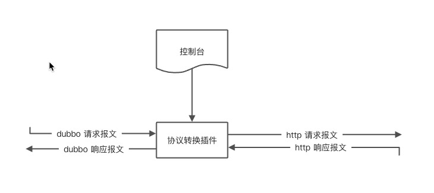
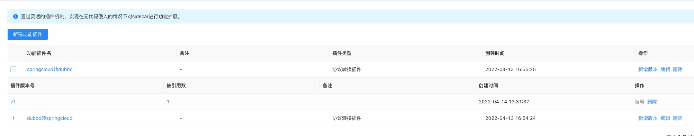
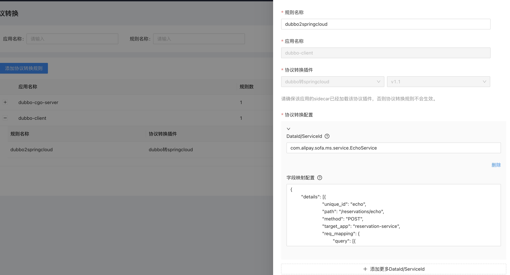
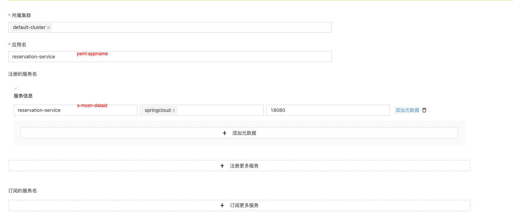

文档修订历史

| 版本号 | 作者 | 备注     | 修订日期  |
| ------ | ---- | -------- | --------- |
| 1.1    | [檀少](https://github.com/Tanc010) | 初始版本 | 2022.2.10 |
| 1.2 | [省善](https://github.com/YIDWang) | 初始版本 | 2022.4.10 |

<a name="B1LtO"></a>
### 3.6.1 标准dubbo和spring cloud协议互转实践 —————————— 线上实战篇
本小节主要介绍dubbo转spring cloud协议的实现过程，包括协议转换插件的开发、编译和结合 dsr 控制台，模拟线上操作流程。
<a name="wFy4B"></a>
#### 转换流程


#### 设计实现
我们先展示编写完成后的目录结构
```go
// go-plugin插件仓库根目录
├── configs
│   └── transcoders				// 目录下存储具体协议转换相关配置, eg: dubbo2springcloud
│       └── dubbo2springcloud
│           ├── egress_config.json		// 客户端协议转换配置
│           ├── ingress_config.json		// 服务端协议转换配置
│           ├── metadata.json			// 协议转换插件元数据配置，比如依赖版本信息
└── plugins
    └── transcoders				// 目录下存储激活插件入口代码，eg: dubbo2springcloud
        └── dubbo2springcloud
            └── main				//  go插件规范，需要package为main
                └── dubbo2springcloud.go
```
dubbo转spring cloud协议转换插件dubbo2springcloud.go实现提供了示例，请参考开源实现[dubbo2springcloud.go](https://github.com/mosn/extensions/blob/master/go-plugin/plugins/transcoders/dubbo2springcloud/main/dubbo2sp.go) 。<br />​

协议转换相关配置包含协议转换配置和协议转换插件元数据配置，存放在go-plugin/configs/transcoders目录中：
```go
│── transcoders				// 目录下存储具体协议转换相关配置, eg: dubbo2springcloud
│   └── dubbo2springcloud
│       ├── egress_config.json		// 客户端协议转换配置
│       ├── ingress_config.json		// 服务端协议转换配置
│       ├── metadata.json		// 协议转换插件元数据配置，比如依赖版本信息
```
egress_config.json配置说明如下：
```json
{
    "type":"dubbo2springcloud",                        //协议转换type名称，同协议转换目录名称
    "go_plugin_config":{                               //go plugin插件信息
        "so_path":"./transcoder-dubbo2springcloud.so", //编译后的插件so文件路径
        "src_protocol":"dubbo",                        //原协议，即协议转换前的协议
        "dst_protocol":"springcloud"                   //目标协议，即协议转换后的协议
    },
    "rule_info":{                                           //协议转换插件配置信息
        "upstream_protocol":"springcloud",                  //目标协议
        "description":"dubbo -> spring cloud"              //插件描述
    }
}
```
参考3.6的步骤完成一个dubbo转spring cloud协议转换插件的开发：

- 实现Transcoder接口
```go
//实现Accept方法，要求返回一个bool类型，表示是否进行协议转换，‘false’表示不进行协议转换。
func (t *dubbo2http) Accept(ctx context.Context, headers api.HeaderMap, buf api.IoBuffer, trailers api.HeaderMap) bool {
    _, ok := headers.(*dubbo.Frame)
    if !ok {
        return false
    }
    config, err := t.getConfig(ctx, headers)
    if err != nil {
        return false
    }
    t.config = config
    return true
}

//实现TranscodingRequest方法，对dubbo请求报文的headers、buf、trailers做转换，返回springcloud报文的headers、buf、trailers。
func (t *dubbo2http) TranscodingRequest(ctx context.Context, headers api.HeaderMap, buf api.IoBuffer, trailers api.HeaderMap) (api.HeaderMap, api.IoBuffer, api.HeaderMap, error) {
	log.DefaultContextLogger.Debugf(ctx, "[dubbo2http transcoder] request header %v ,buf %v,", headers, buf)
	// 2. 验证请求报文是dubbo
	sourceHeader, ok := headers.(*dubbo.Frame)
	if !ok {
		return nil, nil, nil, fmt.Errorf("[xprotocol][dubbo] decode dubbo header type error")
	}
	t.Id = sourceHeader.GetRequestId()
	// 3. 解析dubbo报文
	content, err := DeocdeWorkLoad(headers, buf)
	if err != nil {
		return nil, nil, nil, err
	}
    //4. 构造springcloud报文
	reqHeaderImpl, byteData := buildRequestParameter(content, sourceHeader)
	reqHeaderImpl.Set("Content-Type", "application/json")
	reqHeaders := http.RequestHeader{reqHeaderImpl}
	return reqHeaders, buffer.NewIoBufferBytes(byteData), nil, nil
}

//实现TranscodingResponse方法，对springcloud响应报文的headers、buf、trailers做转换，返回dubbo报文的headers、buf、trailers。
func (t *dubbo2http) TranscodingResponse(ctx context.Context, headers api.HeaderMap, buf api.IoBuffer, trailers api.HeaderMap) (api.HeaderMap, api.IoBuffer, api.HeaderMap, error) {
	log.DefaultContextLogger.Debugf(ctx, "[dubbo2http transcoder] response header %v ,buf %v,", headers, buf)
	//5. 解析springcloud响应报文并转成dubbo报文
    targetRequest, err := DecodeHttp3Dubbo(headers, buf, t.Id)
	if err != nil {
		return nil, nil, nil, err
	}
	return targetRequest.GetHeader(), targetRequest.GetData(), trailers, nil
}
```

- 实现LoadTranscoderFactory方法
```go
func LoadTranscoderFactory(cfg map[string]interface{}) transcoder.Transcoder {
	return &dubbo2http{cfg: cfg}
}
```
<a name="AMYYs"></a>

- 转换配置：由于dubbo报文无法直接转换成http报文，比如，http的path，method等信息就无法从dubbo报文中得到，或者dubbo的参数应该转成http body参数还是query参数也无法知晓。而这些信息可以从转换配置中得到。本实践demo控制台下发的转换配置如下：
```json
{
  "details": [{
    "unique_id": "echo",
    "path": "/reservations/echo",
    "method": "POST",
    "target_app": "reservation-service",
    "req_mapping": {
      "query": [{
        "type": "java.lang.String",
        "key": "message"
      }]
    }
  }, {
    "unique_id": "add",
    "path": "/reservations/add",
    "method": "POST",
    "target_app": "reservation-service",
    "req_mapping": {
      "query": [{
        "type": "java.lang.Integer",
        "key": "a"
      }, {
        "type": "java.lang.Integer",
        "key": "b"
      }]
    }
  }, {
    "unique_id": "sub",
    "path": "/reservations/sub",
    "method": "POST",
    "target_app": "reservation-service",
    "req_mapping": {
      "body": {
        "type": "com.alipay.sofa.ms.service.model.SubReq"
      }
    }
  }]
}
```

转换配置使用说明：<br />
1、解析dubbo协议，匹配`<dubbo.method>`为add的转换配置。<br />
2、根据转换配置构造http请求，请求path为/reservations/add，method为POST，req_mapping 为 dubbo 协议转换模版信息。dubbo的第一个java.lang.Integer类型参数值为http的query参数a,dubbo的第二个java.lang.Integer类型参数值为http的query参数b<br />​<br />
<a name="AZmez"></a>


#### 服务调用
- 编译插件
```shell
make trans plugin=dubbo2springcloud && make codec plugin=dubbo && make codec plugin=springcloud
```
- 插件打包
```shell
make pkg-trans plugin=dubbo2springcloud && make pkg-codec plugin=springcloud,dubbo
```

- 插件上传</br>


- dubbo-client& http-server docker 准备</br>

- 规则配置</br>


- 在服务目录中创建 dubbo-client 并配置 sub 规则。
  
- 在服务目录中创建 http-server 并配置 pub 规则。
  

- 配置 http-server & dubbo 的 sidecar 注入规则。
    
- 在 dubbo 容器中发起调用
```shell
curl  'localhost:10999/meshtest/dubbo/hello?message=hello'
```
- 成功标志
```shell
hello
```

### 备注
- 测试镜像
[dubbo 镜像](yidwang/dubbo-springcloud:v1.0)
[httpserver 镜像](yidwang/demo_http_server)
