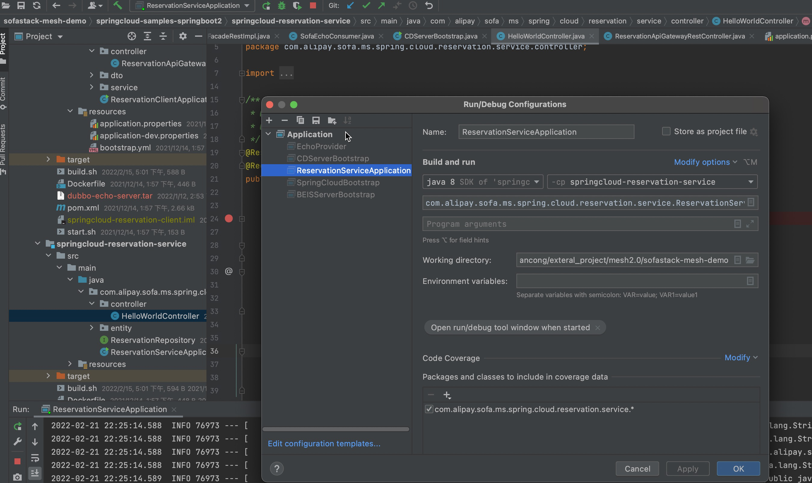
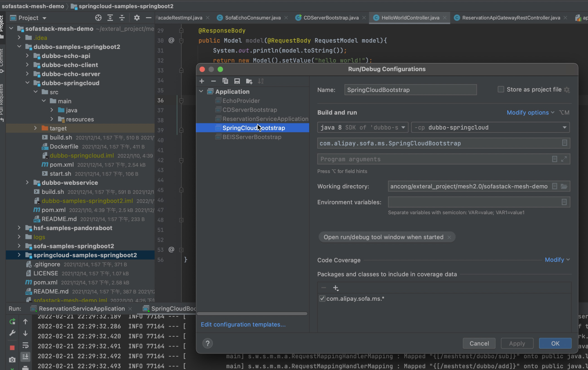

文档修订历史

| 版本号 | 作者 | 备注     | 修订日期  |
| ------ | ---- | -------- | --------- |
| 0.1    | [檀少](https://github.com/Tanc010) | 初始版本 | 2022.2.10 |

<a name="B0LtO"></a>
### 2.6.1 标准dubbo和spring cloud协议互转实践
本小节主要介绍dubbo转spring cloud协议的实现过程，包括协议转换插件的开发、编译和本地跑通验证。
<a name="wFy3B"></a>
#### 转换流程

- 转换配置：保存在egress_config.json（或ingress_config.json）的rule_info.config中。由于dubbo报文无法直接转换成http报文，比如，http的path，method等信息就无法从dubbo报文中得到，或者dubbo的参数应该转成http body参数还是query参数也无法知晓。而这些信息可以从转换配置中得到。本实践demo的转换配置如下：
```bash
{//协议转换插件配置
  "com.alipay.sofa.ms.service.EchoService.add":{    //dubbo到http的报文字段映射
    "http_path":"/reservations/add",                //http的path字段
    "http_method":"POST",                           // http的method字段
    "http_service":"reservation-service",           //spring cloud的service信息，添加到http header中
    "http_query":[
      {
        "type":"java.lang.Integer",                 //dubbo报文的字段类型
        "key":"a"                                   //http的query参数
      },
      {
        "type":"java.lang.Integer",                //dubbo报文的字段类型
        "key":"b"                                  //http的query参数
      }
    ]
  }
}
```
转换配置使用说明：<br />1、解析dubbo协议，匹配`<dubbo.interface>.<dubbo.method>`为com.alipay.sofa.ms.service.EchoService.add的转换配置。<br />2、根据转换配置构造http请求，请求path为/reservations/add，method为POST，dubbo的第一个java.lang.Integer类型参数值为http的query参数a,dubbo的第二个java.lang.Integer类型参数值为http的query参数b<br />​<br />
<a name="AZmez"></a>
#### 设计实现
我们先展示编写完成后的目录结构
```go
// go-plugin插件仓库根目录
├── configs
│   └── transcoders				// 目录下存储具体协议转换相关配置, eg: dubbo2springcloud
│       └── dubbo2springcloud
│           ├── egress_config.json		// 客户端协议转换配置
│           ├── ingress_config.json		// 服务端协议转换配置
│           ├── metadata.json			// 协议转换插件元数据配置，比如依赖版本信息
└── plugins
    └── transcoders				// 目录下存储激活插件入口代码，eg: dubbo2springcloud
        └── dubbo2springcloud
            └── main				//  go插件规范，需要package为main
                └── dubbo2springcloud.go
```
dubbo转spring cloud协议转换插件dubbo2springcloud.go实现提供了示例，请参考开源实现[dubbo2springcloud.go](https://github.com/mosn/extensions/blob/master/go-plugin/plugins/transcoders/dubbo2springcloud/main/dubbo2sp.go) 。<br />​

协议转换相关配置包含协议转换配置和协议转换插件元数据配置，存放在go-plugin/configs/transcoders目录中：
```go
│── transcoders				// 目录下存储具体协议转换相关配置, eg: dubbo2springcloud
│   └── dubbo2springcloud
│       ├── egress_config.json		// 客户端协议转换配置
│       ├── ingress_config.json		// 服务端协议转换配置
│       ├── metadata.json		// 协议转换插件元数据配置，比如依赖版本信息
```
egress_config.json配置说明如下：
```bash
{
    "type":"dubbo2springcloud",                        //协议转换type名称，同协议转换目录名称
    "go_plugin_config":{                               //go plugin插件信息
        "so_path":"./transcoder-dubbo2springcloud.so", //编译后的插件so文件路径
        "src_protocol":"dubbo",                        //原协议，即协议转换前的协议
        "dst_protocol":"springcloud"                   //目标协议，即协议转换后的协议
    },
    "matcher_config":{                                //协议转换匹配规则。只有匹配改规则的流量才做dubbo到springcloud的转换
        "matcher_type":"mulit_matcher",               //匹配器类型，用来处理匹配规则
      	"config": {
          "name": "dubbo2springcloud",                //匹配规则名称，同协议转换type名称
          "variables": [
              {
                  "name": "x-mosn-data-id",           //变量名称
                  "values": [
                      "reservation-client"            //变量值
                  ],
                  "operator": "and",                  //条件
                  "regex": false                      //是否是正则匹配
              }
          ]
      }
    },
    "rule_info":{                                           //协议转换插件配置信息
        "upstream_protocol":"springcloud",                  //目标协议
        "description":"dubbo -> spring cloud",              //插件描述
        "config":{                                          //协议转换插件配置
            "com.alipay.sofa.ms.service.EchoService.add":{  //dubbo到http的报文字段映射
                "http_path":"/reservations/add",            //http的path字段
                "http_method":"POST",                       // http的method字段
                "http_service":"reservation-service",       //spring cloud的service信息，添加到http header中
                "http_query":[
                    {
                        "type":"java.lang.Integer",         //dubbo报文的字段类型
                        "key":"a"                           //http的query参数
                    },
                    {
                        "type":"java.lang.Integer",         //dubbo报文的字段类型
                        "key":"b"                           //http的query参数
                    }
                ]
            }
        }
    }
}
```
参考2.6.1的步骤完成一个dubbo转spring cloud协议转换插件的开发：

- 实现Transcoder接口
```go
//实现Accept方法，要求返回一个bool类型，表示是否进行协议转换，‘false’表示不进行协议转换。
func (t *dubbo2http) Accept(ctx context.Context, headers api.HeaderMap, buf api.IoBuffer, trailers api.HeaderMap) bool {
	return true
}

//实现TranscodingRequest方法，对dubbo请求报文的headers、buf、trailers做转换，返回springcloud报文的headers、buf、trailers。
func (t *dubbo2http) TranscodingRequest(ctx context.Context, headers api.HeaderMap, buf api.IoBuffer, trailers api.HeaderMap) (api.HeaderMap, api.IoBuffer, api.HeaderMap, error) {

	log.DefaultContextLogger.Debugf(ctx, "[dubbo2http transcoder] request header %v ,buf %v,", headers, buf)
	// 1. 验证请求报文是dubbo
	sourceHeader, ok := headers.(*dubbo.Frame)
	if !ok {
		return nil, nil, nil, fmt.Errorf("[xprotocol][dubbo] decode dubbo header type error")
	}
	t.Id = sourceHeader.GetRequestId()
	// 2. 解析dubbo报文
	content, err := DeocdeWorkLoad(headers, buf)
	if err != nil {
		return nil, nil, nil, err
	}
    //3. 构造springcloud报文
	reqHeaderImpl, byteData := buildRequestParameter(content, sourceHeader)
	sourceHeader.Header.CommonHeader.Range(func(key, value string) bool {
		if key != fasthttp.HeaderContentLength {
			reqHeaderImpl.Set(key, value)
		}
		return true
	})

	reqHeaderImpl.Set("Content-Type", "application/json")
	reqHeaders := http.RequestHeader{reqHeaderImpl}
	return reqHeaders, buffer.NewIoBufferBytes(byteData), nil, nil
}

//实现TranscodingResponse方法，对springcloud响应报文的headers、buf、trailers做转换，返回dubbo报文的headers、buf、trailers。
func (t *dubbo2http) TranscodingResponse(ctx context.Context, headers api.HeaderMap, buf api.IoBuffer, trailers api.HeaderMap) (api.HeaderMap, api.IoBuffer, api.HeaderMap, error) {
	log.DefaultContextLogger.Debugf(ctx, "[dubbo2http transcoder] response header %v ,buf %v,", headers, buf)
	//4. 解析springcloud响应报文并转成dubbo报文
    targetRequest, err := DecodeHttp2Dubbo(headers, buf, t.Id)
	if err != nil {
		return nil, nil, nil, err
	}
	return targetRequest.GetHeader(), targetRequest.GetData(), trailers, nil
}
```

- 实现LoadTranscoderFactory方法
```go
type paramAdapter struct {
	HttpPath       string           `json:"http_path"`
	HttpMethod     string           `json:"http_method"`
	HttpService    string           `json:"http_service"`
	HttpQuery      []*query         `json:"http_query"`
	HttpBody       *body            `json:"http_body"`
	HttpPathParams []*httpPathParam `json:"http_path_params"`
}

//dubbo报文转springcloud报文的字段映射，中间配置
var conf = map[string]*paramAdapter{}

func LoadTranscoderFactory(cfg map[string]interface{}) transcoder.Transcoder {

    //解析配置
	if cfgJson, err := json.Marshal(cfg); err == nil {
		json.Unmarshal(cfgJson, &conf)
	}

	return &dubbo2http{cfg: cfg}
}
```
<a name="AMYYs"></a>
#### 服务调用

- 编译插件
```shell
make trans plugin=dubbo2springcloud && make codec plugin=dubbo trans=dubbo2springcloud && make codec plugin=springcloud
```

- 编译sidecar
```shell
make ant
```

- 启动springcloud服务端

<br />**springcloud服务端demo：**[springcloud-reservation-service](https://github.com/sofastack-guides/sofastack-mesh-demo/tree/master/springcloud-samples-springboot2/springcloud-reservation-service)

- 启动dubbo客户端

<br />dubbo客户端demo：[dubbo-springcloud](https://github.com/sofastack-guides/sofastack-mesh-demo/tree/master/dubbo-samples-springboot2/dubbo-springcloud)

- 启动mosn
```shell
make start
```

- 服务路由推送配置
```bash
{
    "enable_pub":true,
    "services":[
        {
            "id":"reservation-service",
            "parameters":{
                "protocol":"springcloud",
                "host":"127.0.0.1:18999"
            }
        }
    ],
    "references":[
        {
            "id":"reservation-service",
            "parameters":{
                "protocols":"springcloud"
            }
        }
    ]
}
```

- 调用
```shell
curl -X GET  127.0.0.1:10999/meshtest/dubbo/add?a=1\&b=9
10
```