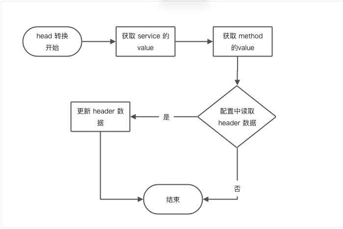
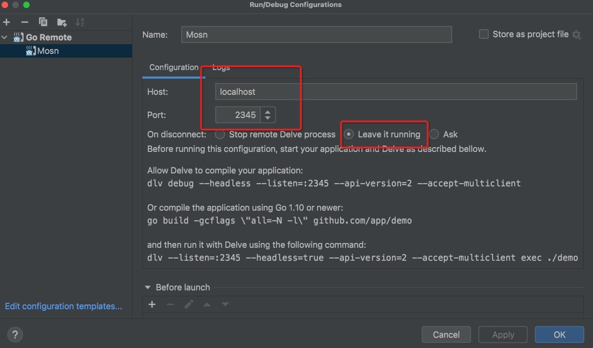

文档修订历史

| 版本号 | 作者 | 备注     | 修订日期  |
| ------ | ---- | -------- | --------- |
| 0.1    | [省善](https://github.com/YIDWang) | 初始版本 | 2022.1.22 |

## 2.4 标准 bolt 和 spring cloud 协议互转实践 —————————— 本地调试篇
在前面已经介绍过协议转换的接口，下面从设计实现、服务调试两方面介绍 bolt 转 springcloud 协议。 其中 bolt 传输格式采用 json 方式。

### 设计实现
本次协议转换难点在于如何将 bolt 协议包转换为 springcloud 的协议包。其中协议包分成转换三部分：headers：数据控制针，buf：数据具体信息，trailers：数据控制针。由于 bolt 没有 trailers 且 buf 采用 json 方式数据编码，而 springcloud 同样buf采用json编码格式传输。因此本次只涉及到 header 数据转换。
#### Accept
本次协议转换插件只处理 `mosn.io/extensions/go-plugin/pkg/protocol/bolt` 包生产的数据，因此实现如下：
[Accept](https://github.com/mosn/extensions/blob/d989cd524d04465bec5069de35b019ba31819ef6/go-plugin/plugins/transcoders/bolt2springcloud/main/bolt2sp.go#L52)
#### TranscodingRequest
##### bolt 转 springcloud header 结构处理
在微服务中协议转换关键在与路由寻址，开发者需要知道上游和下游寻址关系，例如本次开发事例中 bolt 和 springcloud 通过 `com.alipay.sofa.ms.service.SofaEchoService:1.0` 构建的关系。

springcloud 是基于 http 协议扩展的，需要解决 http header中 host、path、method 和 bolt 数据对应关系，bolt 协议寻址则通过 service 和 method 负责。从数据流向来看，可以通过 bolt header 获取 service 和 method 信息，根据静态配置或者动态配置查到对应的 http 的映射关系，用于构建 http 的 header 信息。
当前 mosn 框架处理 http 请求默认处理为 host 为空、path 为 / 、method 为 POST。



#### TranscodingResponse
##### bolt 转 springcloud header 结构处理
本次阶段处理 springcloud 转 bolt head 处理逻辑。只需要注意以下几点即可。
* bolt 请求 ID 回写 bolt 响应 ID
* 设定 bolt 传输协议格式 JSON。
* 设置 bolt 响应 class 信息，与 bolt 请求 class 对应即可。
* 处理 http 响应码 和 bolt 协议响应码转换关系。


### 服务调试
#### 前置工程准备
##### demo 准备
bolt 和 springcloud demo 准备,当前使用仓库地址为 [sofastack-mesh-demo](https://github.com/sofastack-guides/sofastack-mesh-demo)
修改 sofa-samples-springboot2-endpoint.xml 文件指定传输为 json 格式。
``` xml
     <sofa:reference id="echoService" interface="com.alipay.sofa.ms.service.SofaEchoService">
        <sofa:binding.bolt>
            <sofa:global-attrs serialize-type="json"/>
        </sofa:binding.bolt>
     </sofa:reference>
```
##### 插件配置准备
根据插件开发设计编写插件 egress_config.json、metadata.json ，metadata.json 按照模版填写基础信息即可
egress_config.json 配置如下：
```bash
{
  "type":"bolt2springcloud",           // 插件名字
  "go_plugin_config": {                // 协议转换插件配置
    "so_path":"./bolt2springcloud.so", // Transcoder 插件路径，只在本地调试才需要配置
    "src_protocol":"bolt",             // 原协议
    "dst_protocol":"springcloud"       //目标协议
  },
  "matcher_config":{
    "matcher_type": "mulit_matcher" ,  // 默认匹配方式
    "config": {
      "name": "bolt2springcloud",
      "variables": [
        {
          "name": "service",
          "values": [
            "com.alipay.sofa.ms.service.SofaEchoService:1.0"
          ],
          "operator": "and",
          "regex": false
        }
      ]
    }
  },
  "rule_info":{                                                     // 协议转化规则配置
    "upstream_protocol":"springcloud", 
    "description":"hello",
    "config": {                                                     //当前插件静态配置
        "class":"com.alipay.sofa.rpc.core.response.SofaResponse",   // response转request的 bolt class 信息。
        "service":"com.alipay.sofa.ms.service.SofaEchoService:1.0", // 路由寻址配置 
        "com.alipay.sofa.ms.service.SofaEchoService:1.0":{          // request转response映射关系
            "echo":{
              "x-mosn-path":"/reservations/hello",
              "x-mosn-host":"",
              "x-mosn-method":"GET"
            }
        }
    }
  },
  "config": {
    "User":"admin" 
  }
}
```

#### 打包准备
目前需要准备协议插件：bolt 、springcloud ，协议转换插件：bolt2springcloud。
```shell
make trans plugin=bolt2springcloud && make codec plugin=bolt trans=bolt2springcloud && make codec plugin=springcloud
```

#### sidecar 准备
```shell
make ant
```

#### 构建成功 ``` extensions/go-plugin/build ``` 目录结构展示
```
.
├── [ 128]  codecs
│   ├── [ 288]  bolt
│   │   ├── [  33]  codec-bolt.md5
│   │   ├── [ 13M]  codec-bolt.so
│   │   ├── [1.7K]  egress_bolt.json
│   │   ├── [2.3K]  ingress_bolt.json
│   │   ├── [ 318]  metadata.json
│   │   ├── [3.2K]  mosn_config.json
│   │   └── [  96]  transcoders
│   │       └── [ 192]  bolt2springcloud
│   │           ├── [1.1K]  egress_config.json
│   │           ├── [ 217]  metadata.json
│   │           ├── [  33]  transcoder-bolt2springcloud.md5
│   │           └── [ 17M]  transcoder-bolt2springcloud.so
│   └── [ 224]  springcloud
│       ├── [  33]  codec-springcloud.md5
│       ├── [1.6M]  codec-springcloud.so
│       ├── [1.4K]  egress_springcloud.json
│       ├── [1.4K]  ingress_springcloud.json
│       └── [ 335]  metadata.json
├── [  96]  image
│   └── [ 382]  Dockerfile
├── [  96]  sidecar
│   └── [ 128]  binary
│       ├── [139M]  mosn
│       └── [  33]  mosn-1.26.0-5f0f1e753.md5
└── [  96]  transcoders
    └── [ 192]  bolt2springcloud
        ├── [1.1K]  egress_config.json
        ├── [ 217]  metadata.json
        ├── [  33]  transcoder-bolt2springcloud.md5
        └── [ 17M]  transcoder-bolt2springcloud.so

10 directories, 22 files
```

### 服务调试
* mosn 启动
> ``` make start ```
* 服务路由推送配置
>```bash
>{
>    "enable_pub": true,
>    "services": [
>        {
>            "id": "com.alipay.sofa.ms.service.SofaEchoService:1.0",
>            "parameters": {
>                "protocol": "springcloud",
>                "host": "127.0.0.1:8080"
>            }
>        }
>    ],
>    "references": [
>        {
>            "id": "com.alipay.sofa.ms.service.SofaEchoService:1.0",
>            "parameters": {
>                "protocols": "springcloud,bolt"
>            }
>        }
>    ]
>}
>```
* Goland IDE 启动 sidecar

> 

* demo springcloud 启动

> 

*demo bolt 启动

> 

* 成果展示

> 
 
## 请求处理流程


## 响应处理流程

