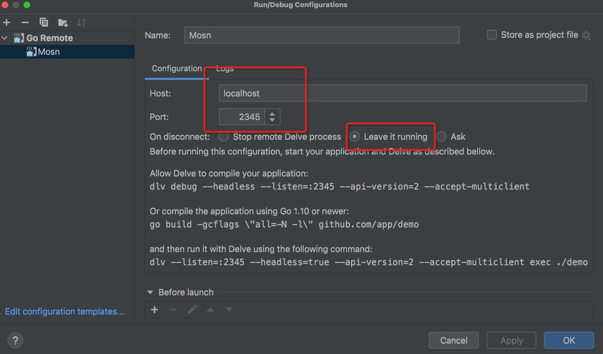

文档修订历史

| 版本号 | 作者 | 备注     | 修订日期  |
| ------ | ---- | -------- | --------- |
| 0.1    | [省善](https://github.com/YIDWang) | 初始版本 | 2022.4.10 |

## 2.4 标准 xml 和 springcloud 协议互转实践 
在前面已经介绍过协议转换的接口，下面从设计实现、服务调试两方面介绍 xml 转 springcloud 协议。 springcloud 和 xml 返回的数据格式保持一致。

### 设计实现
[xml 数据包解析](https://github.com/mosn/extensions/blob/master/go-plugin/doc/2.3xml.md#231-%E7%BC%96%E8%A7%A3%E7%A0%81%E5%AE%9E%E7%8E%B0) 后 head 为 kv 格式，body 为 xml 格式。springcloud 数据包格式和xml 保持一致。因此 body 为协议无关，不需要转换，只需修正 header 即可。

#### Accept
本次协议转换插件只处理 `mosn.io/extensions/go-plugin/pkg/protocol/xr` 包生产的数据，因此实现如下：
```go
func (t *xr2springcloud) Accept(ctx context.Context, headers api.HeaderMap, buf api.IoBuffer, trailers api.HeaderMap) bool {
	_, ok := headers.(*xr.Request) // 数据判断
	if !ok {
		return false
	}
	config, err := t.getConfig(ctx, headers) //获取配置
	if err != nil {
		return false
	}
	t.config = config
	return true
}
```

#### TranscodingRequest
##### xml 转 springcloud header 结构处理
本次 header 转换 与 2.6.1 中 bolt 转 springcloud 比较相似，需要处理内容如下：
* 组装 springcloud 服务标识, 更新 header 中 X-TARGET-APP 数据。
* 通过配置对 http header 的 path、method 处理。
备注： mosn 框架处理 http 请求默认处理为 host 为空、path 为 / 、method 为 POST。

```go
func (t *xr2springcloud) TranscodingRequest(ctx context.Context, headers api.HeaderMap, buf api.IoBuffer, trailers api.HeaderMap) (api.HeaderMap, api.IoBuffer, api.HeaderMap, error) {
	_, ok := headers.(*xr.Request)
	if !ok {
		return nil, nil, nil, fmt.Errorf("[xprotocol][xr] decode xr header type error")
	}
	reqHeaderImpl := &fasthttp.RequestHeader{}
	reqHeaderImpl.Set("x-mosn-method", t.config.Method)
	reqHeaderImpl.Set("x-mosn-path", t.config.Path)
	reqHeaderImpl.Set("X-TARGET-APP", t.config.TragetApp)
	reqHeaders := http.RequestHeader{reqHeaderImpl}
	return reqHeaders, buf, trailers, nil
}
```

#### TranscodingResponse
##### xml 转 springcloud header 结构处理
本次阶段处理 springcloud 转 xml head 处理逻辑。只需要注意以下几点即可。
* 处理 http 响应码 和 xml 协议响应码转换关系。
* 组装 xml 数据针。

```go
func (t *xr2springcloud) TranscodingResponse(ctx context.Context, headers api.HeaderMap, buf api.IoBuffer, trailers api.HeaderMap) (api.HeaderMap, api.IoBuffer, api.HeaderMap, error) {
	_, ok := headers.(http.ResponseHeader)
	if !ok {
		return nil, nil, nil, fmt.Errorf("[xprotocol][xr] decode http header type error")
	}
	//header
	xrResponse := xr.Response{}
	payloads := buffer.NewIoBufferBytes(buf.Bytes())
	respHeader := xr.NewRpcResponse(&xrResponse.Header, payloads)
	if respHeader == nil {
		return nil, nil, nil, fmt.Errorf("[xprotocol][xr] decode http header type error")
	}
	return respHeader.GetHeader(), respHeader.GetData(), trailers, nil
}
```


### 服务调试
#### 前置工程准备
##### xml 和 springcloud demo 准备

##### 插件配置准备
根据插件开发设计编写插件 egress_config.json、metadata.json ，metadata.json 按照模版填写基础信息即可
egress_config.json 配置如下：
```json lines
{
    "type": "xr2springcloud",
    "go_plugin_config": {
        "so_path": "./transcoder-xr2springcloud.so",
        "src_protocol": "xr",
        "dst_protocol": "springcloud"
    },
    "matcher_config": {
        "matcher_type": "mulit_matcher",
        "config": {
            "name": "xr2springcloud",
            "enable": true,
            "variables": [
                {
                    "name": "x-mosn-data-id",
                    "values": [
                        "CIMT000070"
                    ],
                    "config":"{\"details\":[{\"unique_id\":\"echo\",\"path\":\"/xr2springcloud/echo\",\"method\":\"GET\",\"target_app\":\"http.server\"}]}"
                }
            ]
        }
    },
    "rule_info": {
        "upstream_protocol": "springcloud",
        "description": "xr -> spring cloud"
    },
    "config": {
        "User": "admin"
    }
}
```
```json
{ // config
  "details": [
    {
      "unique_id": "echo",
      "path": "/xr2springcloud/hello",
      "method": "GET",
      "target_app": "http.server"
    }
  ]
}
```

#### 打包准备
目前需要准备协议插件：xr、springcloud ，协议转换插件：xr2springcloud。
```shell
make trans plugin=xr2springcloud && make codec plugin=xr trans=xr2springcloud && make codec plugin=springcloud
```

#### 环境变量准备
更新配置 /etc/ant/env_conf 文件中 PLUGINS_ACTIVE 字段
```json
[{"kind":"transcoder","plugins":[{"name":"xr2springcloud","version":"default"}]}]
```

#### sidecar 准备(选做)
```shell
make ant
```

### 服务调试
* mosn 启动
> ``` make start ```

* 服务路由推送配置(/mosn.io/extensions/go-plugin/configs/transcoders/xr2springcloud/pubsub.sh)

```bash
#!/bin/bash
echo "pub service http.server@springcloud"
curl -X POST -d '{"protocolType": "springcloud", "providerMetaInfo": { "appName": "springcloud-provider","properties": {"application": "springcloud-provider","port": "18999" }},"serviceName": "http.server@springcloud"}' localhost:13330/services/publish

sleep 2

echo "sub service http.server@springcloud"
curl -X POST -d '{"protocolType":"springcloud","serviceName":"http.server@springcloud"}' localhost:13330/services/subscribe
```

* Goland IDE 启动 sidecar

> 

* 启动 springcloud 服务
```shell
docker pull yidwang/demo_http_server
docker run -p 18080:18080 demo_http_server
```

* springcloud 服务发起 pubsub
```shell
sh pub_sub.sh
```

* 启动 xml 客户端
```shell
sh request.sh
```

* 成功例子
```shell
$ sh request.sh

=======5.2.2======
127.0.0.1 2045
2022-04-06,17:18:1649236685
00000667<Service><Header><ServiceCode>CIMT000070</ServiceCode><ChannelId>C48</ChannelId><ExternalReference>202204061718059493</ExternalReference><OriginalChannelId>C49</OriginalChannelId><OriginalReference>06221113270051159201000092010000</OriginalReference><RequestTime>20210622111327543</RequestTime><Version>1.0</Version><RequestType>0</RequestType><Encrypt>0</Encrypt><TradeDate>20210617</TradeDate><RequestBranchCode>CN0010001</RequestBranchCode><RequestOperatorId>FB.ICP.X01</RequestOperatorId><RequestOperatorType>1</RequestOperatorType><TermType>00000</TermType><TermNo>0000000000</TermNo></Header><Body><Request><CustNo>3001504094</CustNo></Request></Body></Service>
--------START telnet---------
Trying 127.0.0.1...
Connected to localhost.
Escape character is '^]'.
00000667<Service><Header><ServiceCode>CIMT000070</ServiceCode><ChannelId>C48</ChannelId><ExternalReference>202204061718059493</ExternalReference><OriginalChannelId>C49</OriginalChannelId><OriginalReference>06221113270051159201000092010000</OriginalReference><RequestTime>20210622111327543</RequestTime><Version>1.0</Version><RequestType>0</RequestType><Encrypt>0</Encrypt><TradeDate>20210617</TradeDate><RequestBranchCode>CN0010001</RequestBranchCode><RequestOperatorId>FB.ICP.X01</RequestOperatorId><RequestOperatorType>1</RequestOperatorType><TermType>00000</TermType><TermNo>0000000000</TermNo></Header><Body><Request><CustNo>3001504094</CustNo></Request></Body></Service>Connection closed by foreign host.
```
