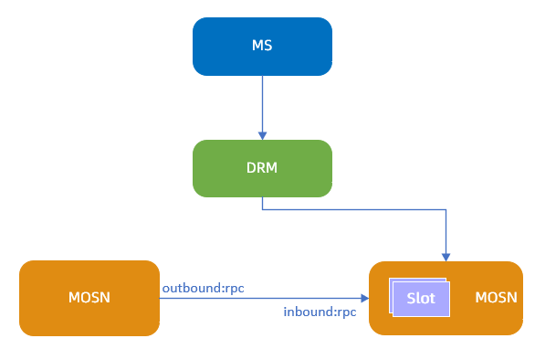
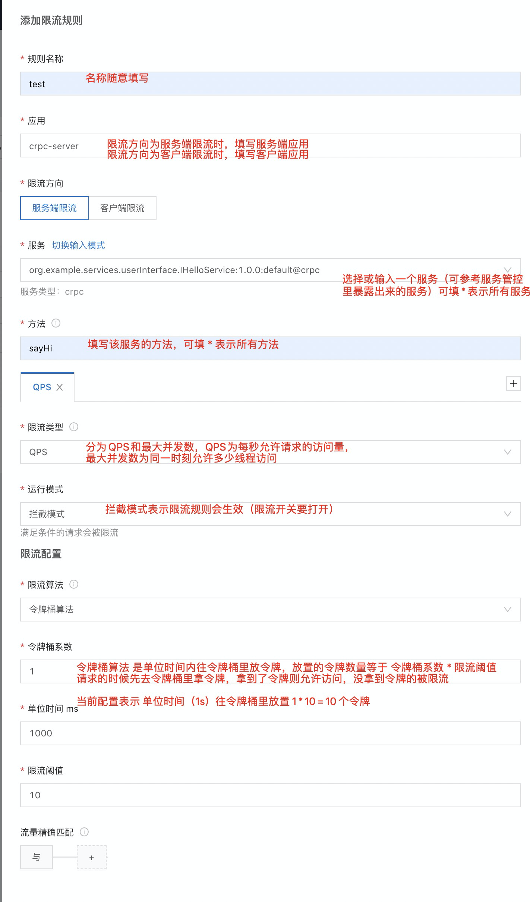
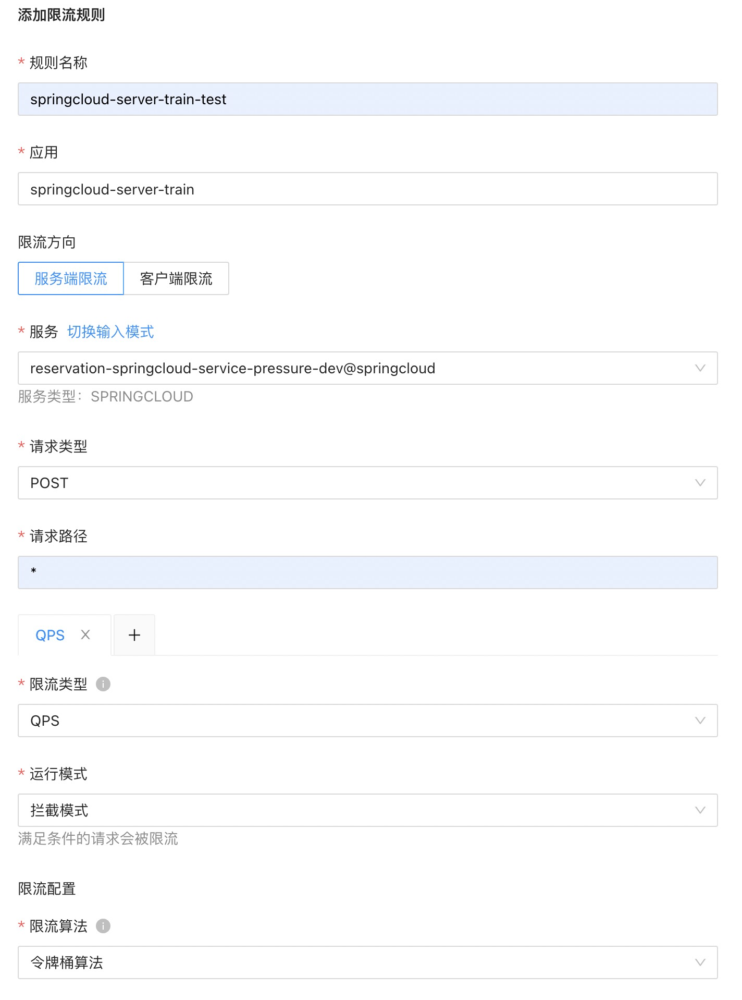
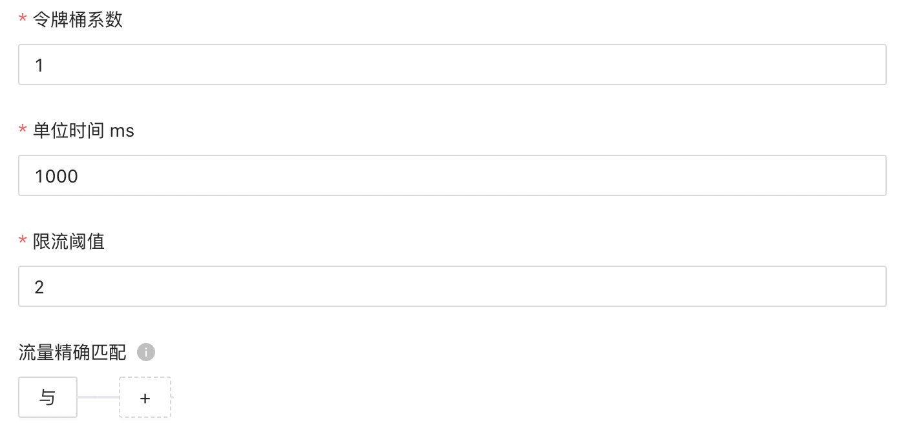
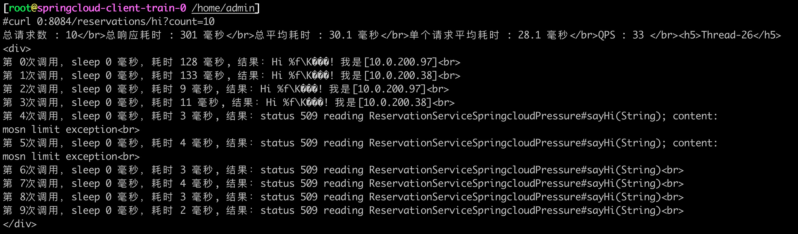
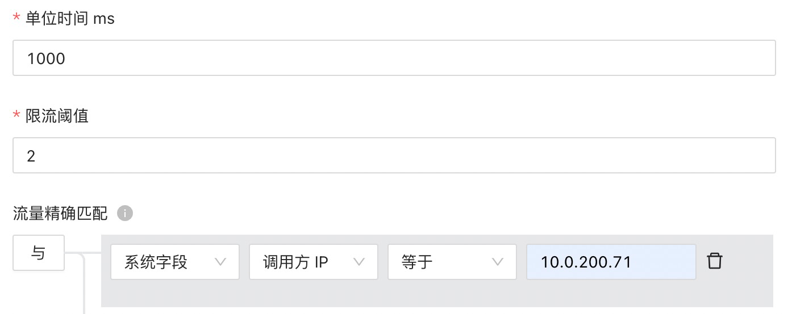
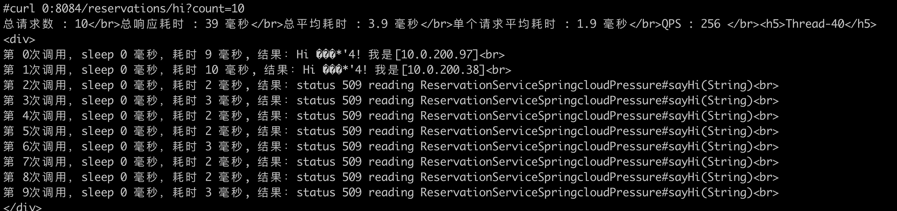
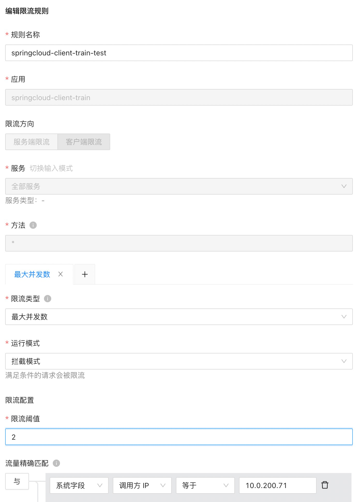
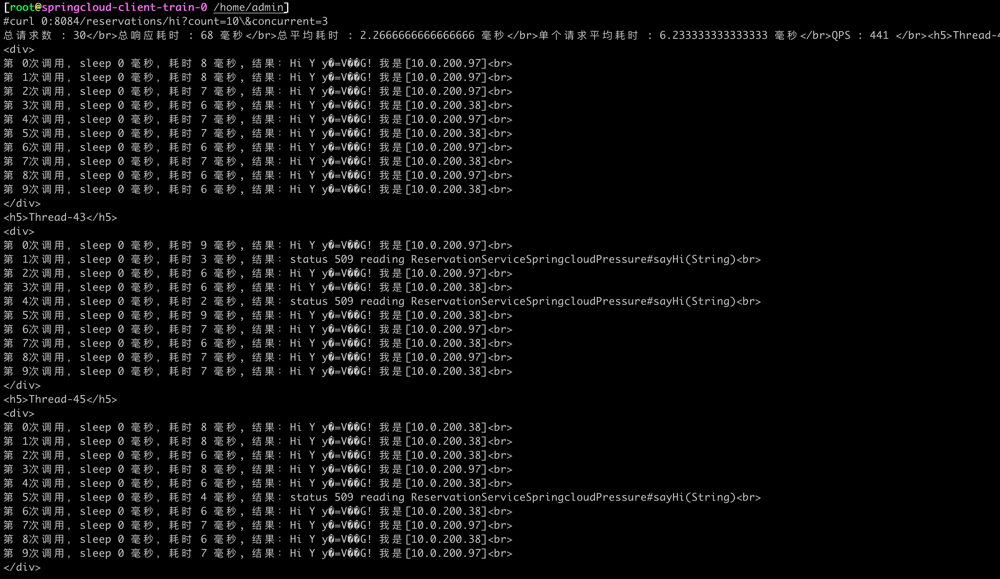

文档修订历史

| 版本号 | 作者                               | 备注     | 修订日期      |
|-----|----------------------------------| -------- |-----------|
| 0.1 | [檀少](https://github.com/Tanc010) | 初始版本 | 2022.5.10 |

<a name="LjFmL"></a>
## 2.7.1 服务限流
在高并发场景下，为保证在现有资源条件下服务正常运行，使用服务限流让请求和并发在应用可接受的范围内，达到高可用的目的。服务网格的限流通过 MOSN 实现，支持统一的限流模型，对用户透明，并且在产品层增加了 trafficCondition 的流量匹配规则。
### 功能简介
#### 限流原理


服务限流生效流程如下：

1. 服务限流通过微服务管控台 MS 下发限流配置到分布式配置中心 DRM。
1. DRM 将限流的动态配置下发到 MOSN。限流规则在客户端或服务端生效，以下流程以客户端限流为例。
1. 客户端应用进行访问时，MOSN 会监控应用流量，如果触发限流规则，应用流量即被限制。

**注意事项**

- 您可以添加多条限流规则，若存在服务名和匹配条件相同，但限速不同的限流规则时，生效限速更小的限流规则。
- 请根据您的实际环境合理配置限速规则，不合理的限速规则可能导致应用访问异常。
#### 添加限流规则

1. 登录 MS控制台。
1. 在左侧菜单栏选择 **服务网格** > **服务治理**，然后单击 **服务限流 **页签**。**
1. 单击**添加限流规则**，然后配置以下参数：
   
   | **参数** | **说明** |
   | --- | --- |
   | **规则名称** | 配置服务限流的规则名称。 |
   | **应用** | 配置应用名称。星号（*）表示所有应用。 |
   | **限流方向** | 选择流量限制的方向，可选值为：<ul><li> **服务端限流**：规则在服务端生效。选择此项时，**应用**需填写服务端的应用，**服务**和 **方法** 填写服务端的服务和方法。<li> **客户端限流**：规则在客户端生效。选择此项时，**应用**需填写客户端的应用；**服务**填写客户端需要调用的服务；**方法** 填写客户端需要调用服务端服务的方法。
      | **服务** | 根据限流方向设置限流的服务。单击 **切换输入模式** 可在手动填写与下拉选择之间切换。 |
      | **方法** | 配置限流的方法。星号（*）表示所有方法。 |
      | **限流类型** | 选择限流的类型，可选值为：<ul><li> **QPS**：单位时间内允许的最大请求数。<li>**最大并发数**：同一时间内允许的最大访问线程数。|
      | **运行模式** | 设置限流规则的运行方式，可选值为：<ul><li> 拦截模式：限流规则生效。<li> 观察者模式：限流规则不生效，仅在 MOSN 中打印限流日志。|
      | **限流算法** | 使用令牌桶（Token Bucket）算法进行限流。仅在 **限流类型**为 **QPS** 时设置。<br>系统会以一个恒定的速度往桶里放入令牌，而如果请求需要被处理，则需要先从桶里获取一个令牌，当桶里没有令牌可取时，则拒绝服务。详情请参见 [令牌桶算法](https://help.aliyun.com/document_detail/149952.htm#h2-u4EE4u724Cu6876u7B97u6CD52)。 |
      | **令牌桶系数** | 设置令牌桶的系数，以决定令牌桶的最大值。默认为 1。<br>令牌数最大值 =（限流阈值 ÷ 单位时间）× 令牌桶系数 |
      | **单位时间 ms** | 设置限速规则的单位时间，单位为 ms。仅在**限流类型**为 **QPS** 时设置。 |
      | **限流阈值** | 根据选择的限流类型设置限流阈值：<ul><li> **限流类型** 为 **QPS** 时：表示单位时间内允许通过最大请求数的值，超过该数值的请求会被限流。<li>**限流类型** 为 **最大并发数** 时：表示同一时间内允许连接的最大访问线程数，超过该阈值的线程会被限流。|
      | **流量精确匹配** | 设置流量的匹配条件，满足匹配条件的流量才会使用限流规则。置空此项时表示匹配所有流量。<br>您可以配置多条匹配条件，多个条件是与的关系，按顺序进行匹配。参数配置如下：<ul><li> **字段**：可选择系统字段和请求头。<li> **字段名**：根据字段类型有不同的值。 <ul><li>系统字段：包括流量类型、调用方应用名、调用方 IP、服务方应用名。 <li>请求头：请求头是指协议的请求头，比如 Dubbo 协议取的是 attachment，HTTP 协议取的是 Request Header。用户可以在应用系统中自定义请求头参数和值。</ul><li>**选择逻辑**：包括等于、不等于、属于、不属于、正则。<li>**字段值**：字段名对应的值。|

4. 单击 **提交**，然后单击 **确定**。
4. 在限流规则列表中，将刚刚创建的限流规则的状态改为 **开**。
#### 编辑限流规则
您可以随时编辑已创建的限流规则，编辑规则会在提交后实时生效。

1. 在 **服务限流** 页签，单击目标限流规则右侧的 **编辑**。
1. 按需求编辑限流规则后，单击 **提交**。
#### 删除限流规则
您可以删除已创建的限流规则，删除规则的操作会实时生效，请谨慎操作。

1. 在 **服务限流** 页签，单击目标限流规则右侧的 **编辑**。
1. 单击 **确定**。

### 2.7.1.1 标准dubbo接入服务限流能力

### 2.7.1.2 传统xml协议接入服务限流能力

### 2.7.1.3 标准springcloud接入服务限流能力
示例配置：

#### 服务端限流
实际配置：


进入客户端的mosn容器，访问客户端暴露的接口，可以看到返回结果中，有请求被限流了，这里能调用通4次是因为服务端有两台服务器，**限流方向为服务端限流时，即在服务端侧进行统计，每台服务端限流 2 笔交易，总计4 笔**
```powershell
kubectl exec -it springcloud-client-train-0 -c mosn-sidecar-container bash

## 访问8084端口的 hi 接口
curl 0:8084/reservations/hi?count=10
```

#### 客户端限流
实际配置


进入客户端的mosn容器，访问客户端暴露的接口，可以看到返回结果中，只有两笔请求能够正常调用
```powershell
kubectl exec -it springcloud-client-train-0 -c mosn-sidecar-container bash

## 访问8084端口的 hi 接口
curl 0:8084/reservations/hi?count=10
```

#### 最大并发数限流

mosn分辨不出来源请求具体是属于哪一个线程，所以无法做到两个线程里的请求全部通过，第三个线程里的请求全部拒绝，只能是一个估算的值。要想精确限流多少个请求，请使用QPS限流。
concurrent 参数表示线程数量
```powershell
kubectl exec -it springcloud-client-train-0 -c mosn-sidecar-container bash

## 访问8084端口的 hi 接口
curl 0:8084/reservations/hi?count=10\&concurrent=3
```
