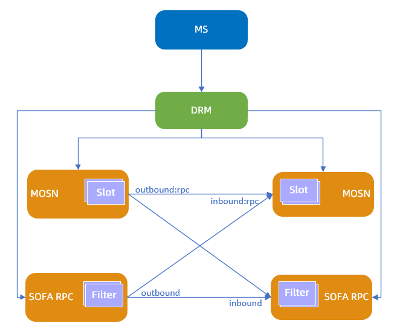
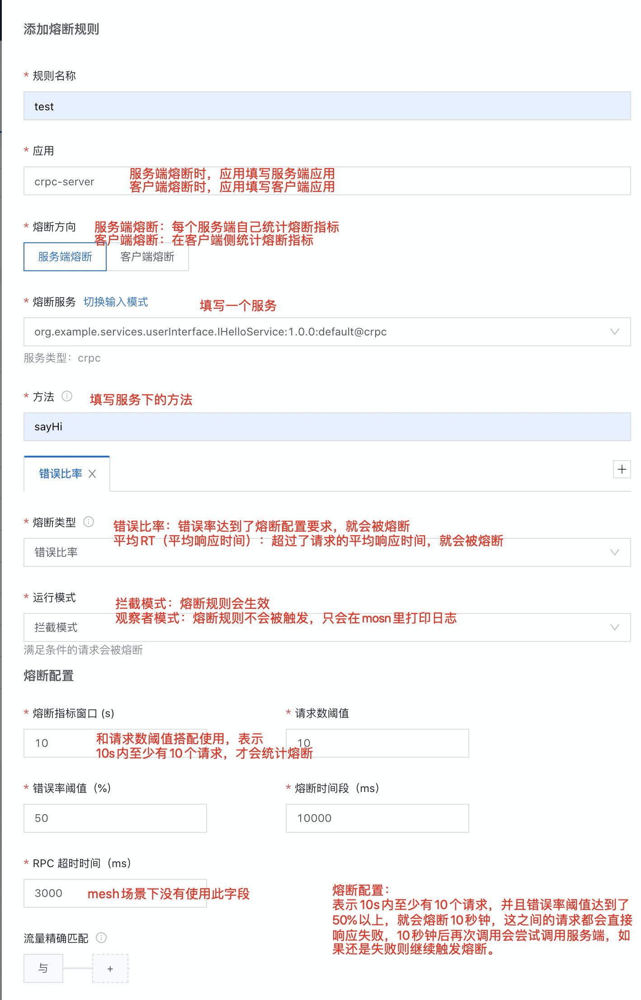
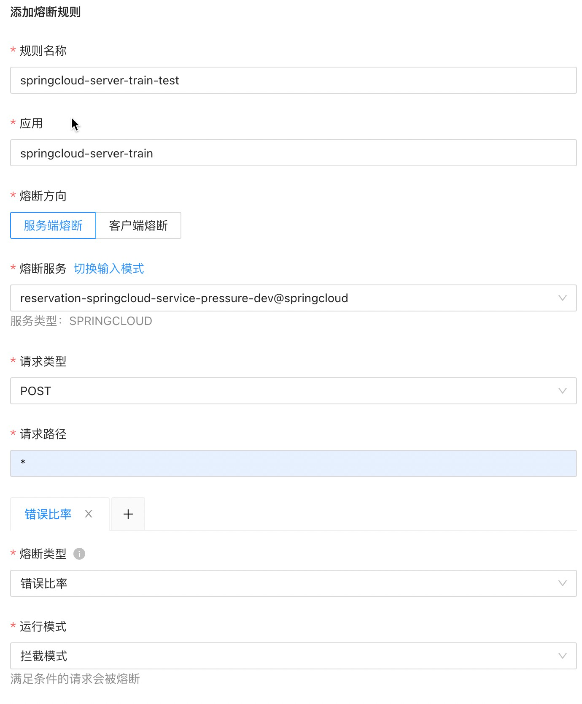
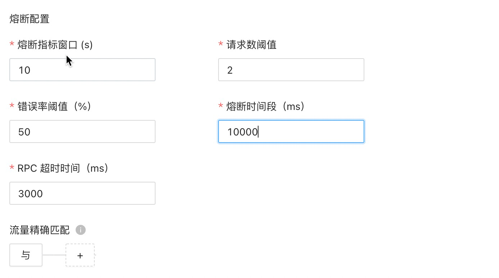
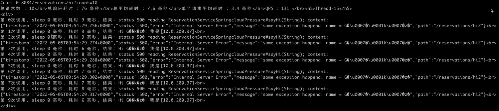
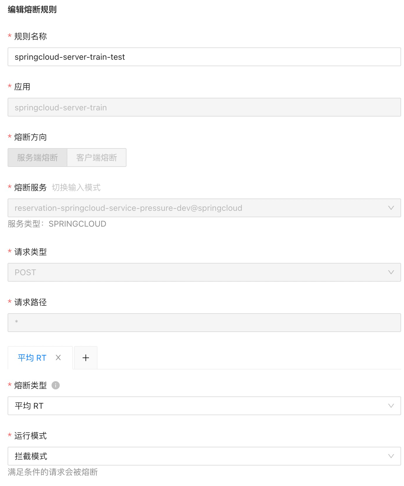
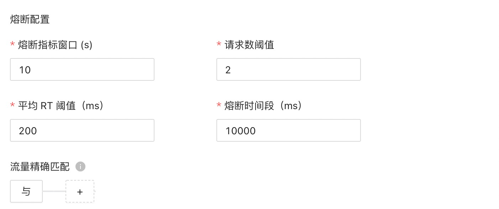
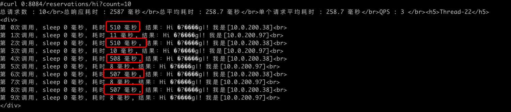
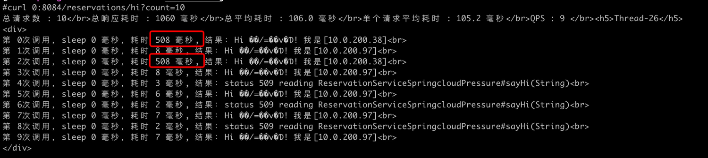

文档修订历史

| 版本号 | 作者                               | 备注     | 修订日期      |
|-----|----------------------------------| -------- |-----------|
| 0.1 | [檀少](https://github.com/Tanc010) | 初始版本 | 2022.5.10 |

<a name="LjFmL"></a>
## 2.7.2 服务熔断
当服务中的服务端接口不稳定，出现频繁超时或错误时，可能会引起服务调用雪崩。您可以对应用开启服务熔断功能，使有故障的服务端及时返回错误，并释放系统资源，提高用户体验和系统性能。
### 功能简介
您可以通过下述操作让故障处于可控范围：

- 通过监控或者服务拓扑查看到某个服务延时较大、错误率较多后，进行服务治理。
- 选择异常服务后，进行自动熔断设置，可自定义熔断条件，例如：在某个时间段内（例如 10s）请求数达到某个值，且错误率或者延时达到某个值。

满足条件，则可以触发熔断。服务熔断后还可以持续测试该服务，进行自动熔断恢复。服务熔断的规则发布流程如下：

1. 通过微服务管控台 MS 下发熔断的动态配置到分布式配置中心 DRM。
1. DRM 将熔断的动态配置下发到 MOSN。
1. MOSN 根据平均 RT 和错误率触发熔断。熔断可在客户端或服务端生效。
#### 创建熔断规则

1. 登录 MS控制台。
1. 在左侧菜单栏选择 **服务网格** > **服务治理**，然后单击 **服务熔断 **页签**。**
1. 单击 **添加熔断规则**，然后配置以下参数：
   
   | **参数** | **说明** |
   | --- | --- |
   | **规则名称** | 配置服务熔断规则的名称。 |
   | **应用** | 配置检测的目标应用。<br>您可以手动填写或在下拉列表中选择。 |
   | **熔断方向** | 配置服务熔断的方向，取值如下：<ul><li>**客户端熔断**：表示熔断规则在客户端生效。在客户端侧统计调用服务端的请求指标，应用填写客户端的应用，服务和方法填写引用的服务端的服务和方法。<li>**服务端熔断**：表示熔断规则在服务端生效，每个服务端单独统计请求指标，应用填写服务端的应用，服务和方法填写服务端的服务和方法。
      | **熔断服务** | 配置熔断的服务。单击 **切换输入模式** 可在手动填写与下拉选择之间切换。 |
      | **方法** | 配置需要熔断的服务的方法名。 |
      | **熔断类型** | 配置熔断的类型，取值如下：<ul><li>**错误比率**：熔断时间窗口内的请求错误率大于错误率阈值时，触发熔断。<li>**平均 RT**：熔断时间窗口内的请求数阈值大于平均 RT 阈值时，触发熔断。
      | **运行模式** | 配置熔断的运行模式，取值如下：<ul><li>**拦截模式**：满足条件的请求会触发熔断规则。<li>**观察者模式**：熔断规则不会被触发，只会在 MOSN 里打印日志。
      | **熔断配置** | 配置触发熔断的各项参数：<ul><li>**熔断指标窗口**：和请求数阈值搭配使用，表示熔断指标窗口内至少有请求数阈值的请求就会纳入熔断指标统计。单位为秒。<li> **请求数阈值**：和熔断指标窗口搭配使用。单位为个。<li>**错误率阈值**：请求数的平均错误率达到此阈值时触发熔断。熔断类型配置为 **错误比率** 时配置。<li>**平均 RT 阈值**：请求响应时间超过此阈值时触发熔断。单位为毫秒。熔断类型配置为 **平均 RT** 时配置。<li>**熔断时间段**：触发熔断后的熔断时长，熔断时长之内的请求会直接返回错误。当熔断超过该时间后会再次尝试调用服务端，如果还是失败则继续触发熔断。<li>**RPC 超时时间**：经典微服务场景会使用。单位为毫秒。熔断类型配置为 **错误比率** 时配置。
      | **流量精确匹配**（可选） | 配置之后，只有满足匹配条件的流量才会使用这份熔断规则。置空表示匹配所有流量。<br>您可以配置多条匹配条件，多个条件是与的关系，按顺序进行匹配。参数配置如下：<ul><li>**字段**：可选择系统字段和请求头。<li>**字段名**：根据字段类型有不同的值。 <ul><li>系统字段：包括流量类型、调用方应用名、调用方 IP、服务方应用名。 <li>请求头：请求头是指协议的请求头，比如 Dubbo 协议取的是 attachment，HTTP 协议取的是 Request Header。用户可以在应用系统中自定义请求头参数和值。</ul><li>**选择逻辑**：包括等于、不等于、属于、不属于、正则。<li>**字段值**：字段名对应的值。

4. 单击 **提交**，然后单击 **确定**。
4. 在熔断规则列表中，将刚刚创建的熔断规则的状态改为 **开启**。
#### 编辑熔断规则
您可以随时编辑已创建的熔断规则，规则提交后会实时生效。

1. 在 **服务熔断** 页签，单击目标应用左侧的加号（+）。
1. 单击目标熔断规则右侧的 **编辑**。
1. 按需求编辑熔断规则后，单击 **提交**。
#### 删除熔断规则
您可以删除已创建的熔断规则，删除操作会实时生效，请谨慎操作。

1. 在 **服务熔断** 页签，单击目标应用左侧的加号（+）。
1. 单击目标熔断规则右侧的 **删除**。
1. 单击 **确定**。
### 2.7.2.3 标准springcloud接入服务熔断能力
熔断配置：

- 熔断指标窗口：单位秒，和请求数阈值搭配使用，表示熔断指标窗口内至少有请求数阈值的请求就会纳入熔断指标统计
- 请求数阈值：单位个，和熔断指标窗口搭配使用
- 错误率阈值：百分比。请求数的平均错误率达到此阈值便会触发熔断
- 熔断时间段：单位毫秒，触发熔断后的熔断时长，熔断时长之内的请求会直接返回错误
- RPC超时时间：单位毫秒，经典微服务场景会使用


#### 错误比率熔断
熔断规则配置：


要验证服务熔断，需要在服务端侧设置接口的抛错或者超时
```powershell
kubectl exec -it springcloud-server-train-v1-0 -c mosn-sidecar-container bash

curl 0:8080/status/set?throwException=true\&sleep=0

```
进入客户端容器，多次调用客户端接口
```powershell
kubectl exec -it springcloud-client-train-0 -c mosn-sidecar-container bash

## 访问8084端口的 hi 接口
curl 0:8084/reservations/hi?count=10
```
调用springcloud-server-train-v1的请求都异常了，返回500错误。接下来我们把熔断规则打开。

打开熔断规则后，发现异常服务返回两次异常（500错误）后便发生了熔断，并返回509错误（这个509是mosn返回的，请求并没有到异常的服务）

#### 平均RT熔断
熔断平均RT规则配置


要验证服务熔断，需要在服务端侧设置接口的抛错或者超时
```powershell
kubectl exec -it springcloud-server-train-v1-0 -c mosn-sidecar-container bash


curl localhost:8080/status/set?throwException=false\&sleep=500

```
进入客户端容器，多次调用客户端接口
```powershell
kubectl exec -it springcloud-client-train-0 -c mosn-sidecar-container bash

## 访问8084端口的 hi 接口
curl 0:8084/reservations/hi?count=10
```
调用springcloud-server-train-v1的请求都有500毫秒的超时。接下来我们把熔断规则打开。

打开熔断规则后，发现耗时请求调用两次后便发生了熔断，并返回509错误（这个509是mosn返回的，请求并没有到耗时的服务）

