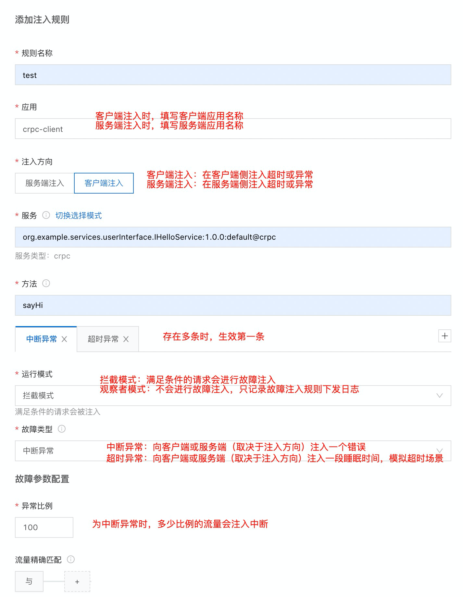
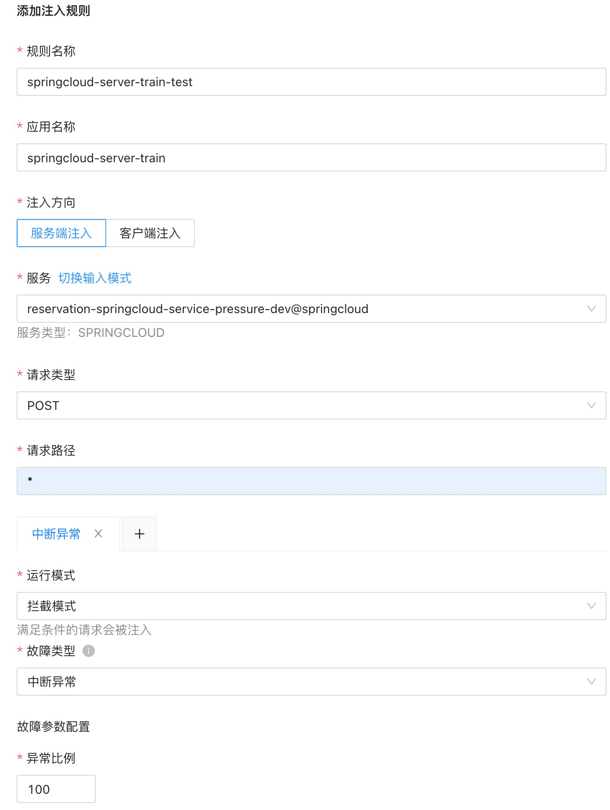
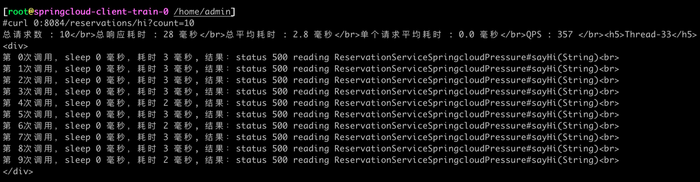
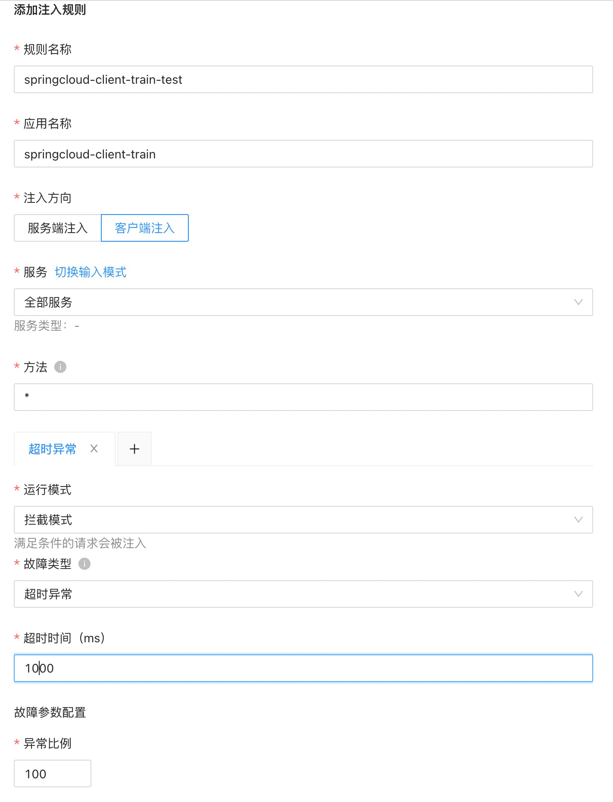

文档修订历史

| 版本号 | 作者                               | 备注     | 修订日期      |
|-----|----------------------------------| -------- |-----------|
| 0.1 | [檀少](https://github.com/Tanc010) | 初始版本 | 2022.5.10 |

<a name="FIFmA"></a>
## 2.7.4 故障注入
您可以通过故障注入功能向测试应用注入故障，检测应用面对异常时的处理情况。您可以根据检测的情况调整您的应用，以减少应用在正式使用时出现的异常问题。多用于测试环境。
<a name="FIFmB"></a>
### 配置说明
<a name="FIFmC"></a>
#### 配置故障注入规则

1. 登录 MS控制台。
1. 在左侧菜单栏选择 **服务网格** > **服务治理**，然后单击 **故障注入 **页签**。**
1. 单击 **添加注入规则**，然后配置以下参数：
   
   | **参数** | **说明** |
   | --- | --- |
   | **规则名称** | 设置故障注入规则的名称。<br>最多不超过 255 个字符。 |
   | **应用** | 选择或填写目标应用的名称。星号（*）表示所有应用。 |
   | **注入方向** | 设置故障注入的方向，可选值为：<ul><li>**服务端注入**：在应用的服务端注入故障。<li>**客户端注入**：在应用的客户端注入故障。
      | **服务** | 配置注入故障的服务。单击 **切换输入模式** 可在手动填写与下拉选择之间切换。 |
      | **方法** | 配置故障注入的方法。星号（*）表示所有方法。 |
      | **运行模式** | 配置故障注入规则的运行模式，取值如下：<ul><li>**拦截模式**：满足条件的故障注入请求会被注入。<li>**观察者模式**：满足条件的故障注入请求不会被注入，只会在 MOSN 里打印日志。
      | **故障类型** | 故障注入支持注入错误或者超时等事件，方便服务的异常测试，用于模拟服务异常的情况。取值如下：<ul><li>**中断异常**：注入运行时异常，中断请求并返回既定的错误状态码。<li>**超时异常**：满足条件的请求，会增加响应时间，请求正常调用。
      | **异常比例** | 设置注入异常流量的比例。例如设置为 80，则只注入 80% 的异常流量。 |
      | **流量精确匹配**（可选） | 设置流量的匹配条件，满足匹配条件的流量才会使用故障注入规则。置空此项时表示匹配所有流量。<br>您可以配置多条匹配条件，多个条件是与的关系，按顺序进行匹配。参数配置如下：<ul><li>**字段**：可选择系统字段和请求头。<li>**字段名**：根据字段类型有不同的值。<ul><li>**系统字段**：包括流量类型、调用方应用名、调用方 IP、服务方应用名。<li>**请求头**：请求头是指协议的请求头。例如 Dubbo 协议取的是 attachment，HTTP 协议取的是 Request Header。用户可以在应用系统中自定义请求头参数和值。</ul><li>**选择逻辑**：包括等于、不等于、属于、不属于、正则。<li>**字段值**：字段名对应的值。

4. 单击 **提交**，然后单击 **确定**。
4. 在故障注入规则列表中，将刚刚创建的故障注入规则的状态改为 **开启**。**说明**当多条故障注入规则针对同一个服务时，只会生效第一条。
<a name="FIFmD"></a>
#### 编辑故障注入规则
您可以随时编辑已创建的故障注入规则，规则提交后实时生效。

1. 在 **故障注入** 页签，单击目标故障注入规则右侧的 **编辑**。
1. 按需求编辑故障注入规则后，单击 **提交**。
<a name="FIFmE"></a>
#### 删除故障注入规则
您可以删除已创建的故障注入规则，删除操作实时生效，请谨慎操作。

1. 在 **故障注入** 页签，单击目标故障注入规则右侧的 **删除**。
1. 单击 **确定**。
<a name="FIFmF"></a>
### 2.7.4.1 标准dubbo接入服务故障注入能力
<a name="FIFmG"></a>
### 2.7.4.2 传统xml协议接入服务故障注入能力
<a name="FIFmH"></a>
### 2.7.4.3 标准springcloud接入故障注入能力

<a name="FIFmI"></a>
#### 服务端故障注入
规则配置

故障注入规则开启后，进入客户端容器，多次调用客户端接口，可以看到所有的请求都被注入了一个异常
```powershell
kubectl exec -it springcloud-client-train-0 -c mosn-sidecar-container bash

## 访问8084端口的 hi 接口
curl 0:8084/reservations/hi?count=10
```

<a name="FIFmJ"></a>
#### 客户端故障注入
客户端注入规则配置

在客户端的应用里配置了超时规则，规则开启后，进入客户端容器，多次调用客户端接口，可以看到所有的请求都被注入了睡眠时间1000ms
```powershell
kubectl exec -it springcloud-client-train-0 -c mosn-sidecar-container bash

## 访问8084端口的 hi 接口
curl 0:8084/reservations/hi?count=10
```

