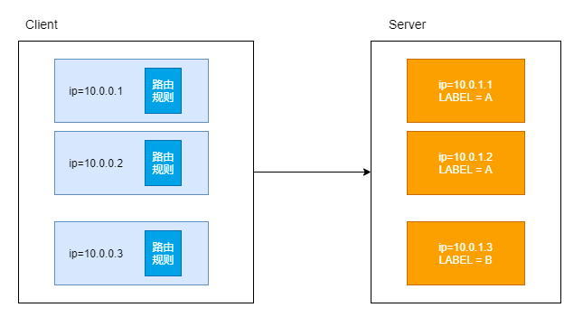
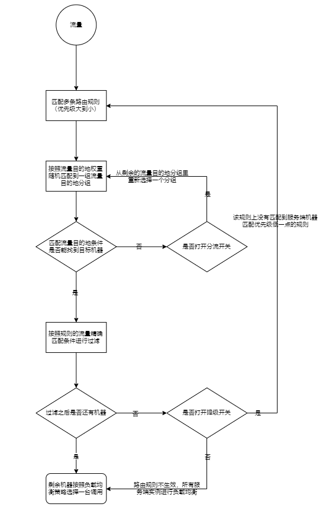
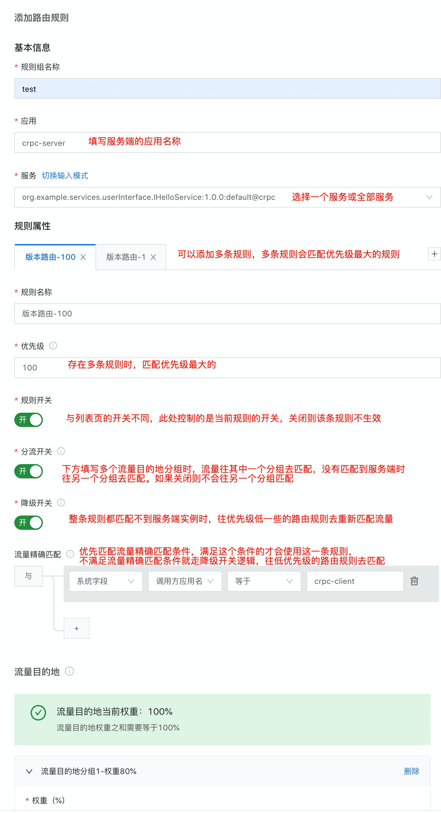
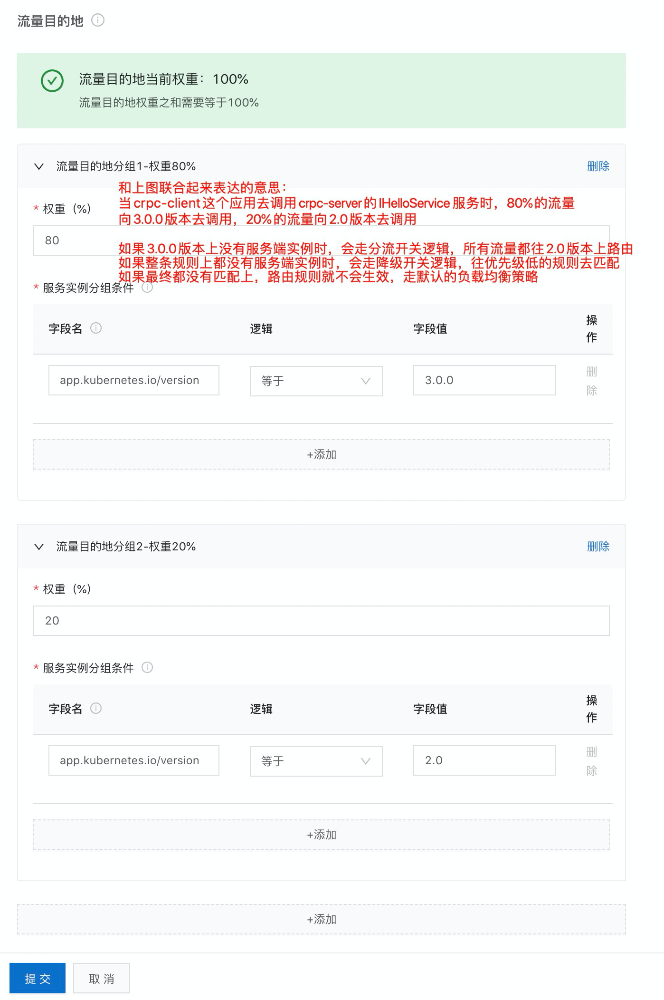
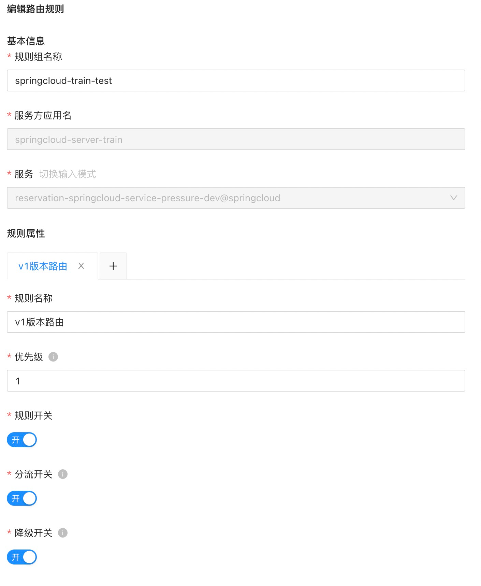
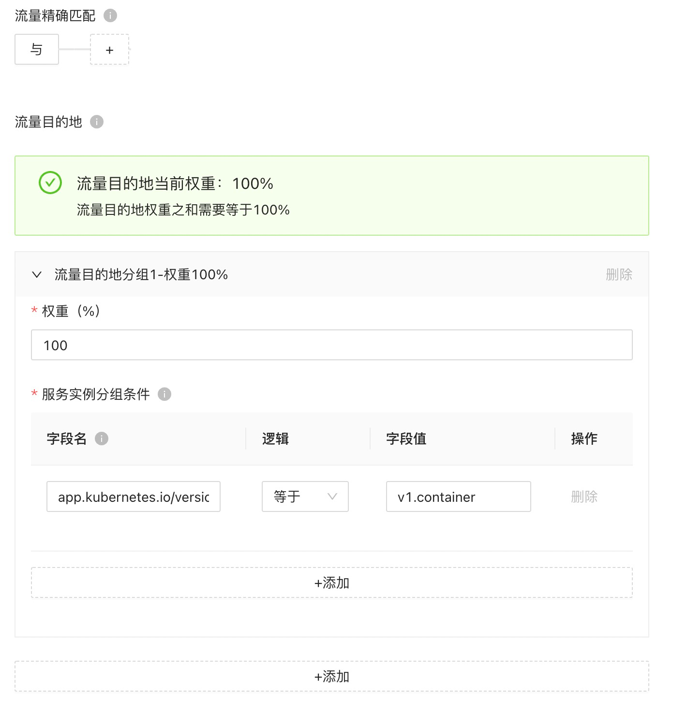
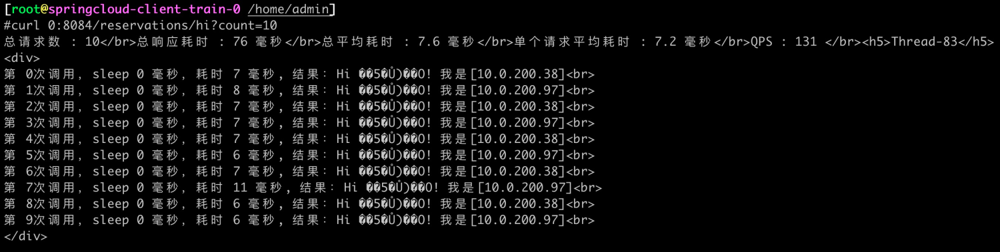
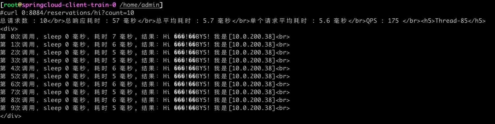
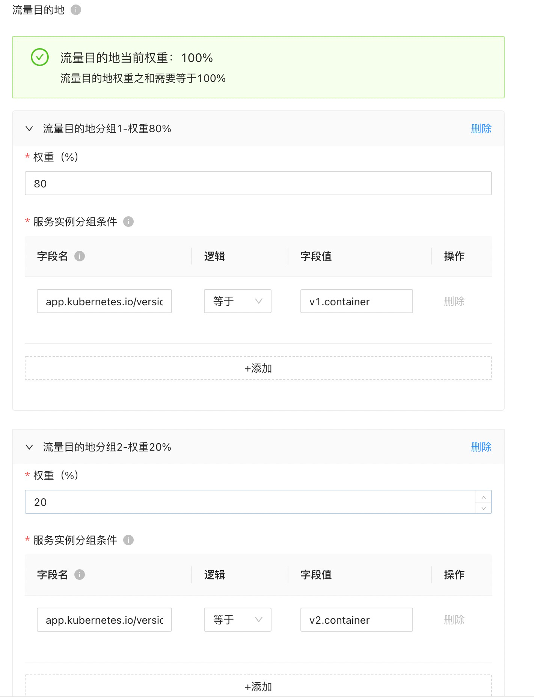
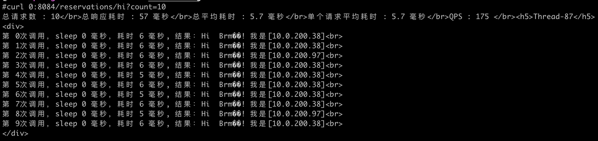

文档修订历史

| 版本号 | 作者                               | 备注     | 修订日期      |
|-----|----------------------------------| -------- |-----------|
| 0.1 | [檀少](https://github.com/Tanc010) | 初始版本 | 2022.5.10 |

<a name="LjFmL"></a>
## 2.7.5 服务路由
当服务消费者面临多个服务提供者时，需要通过路由规则来确定具体的服务提供者。服务路由功能提供了灵活的路由功能，允许您定义多条服务路由规则，可以帮助您解决多个场景下的难题。
### 功能简介
服务路由多用于线下测试连调、蓝绿发布、灰度引流场景，将因版本升级造成的问题影响降到最低。

- 线下测试联调线下测试时，可能会缺少相应环境。您可以将测试应用注册到线上，然后开启路由规则，在本地进行测试。
- 蓝绿发布蓝绿发布时，您可以通过路由规则将流量切换到绿组，以测试新版本应用是否正常。
- 灰度引流灰度发布时，您可以通过路由规则将流量引导到灰度发布的应用版本上，测试灰度发布的版本是否正常。

配置的路由规则实际在服务消费方（即客户端）生效，您可以配置服务路由过滤服务提供方。目前主要有 RPC-Client（经典微服务生效）和 MOSN（服务网格生效）两种执行实体。
在部署服务提供方时，您可以在机器上加固定格式的标签，比如 LABEL=A。路由规则生效流程如下图所示：
#### 添加路由规则

1. 登录 MS控制台
1. 在左侧菜单栏选择 **服务网格** > **服务治理**，然后单击 **服务路由 **页签**。**
1. 单击 **添加服务路由**，然后配置以下参数：
   
   | **区域** | **参数** | **说明** |
   | --- | --- | --- |
   | **基本信息** | **规则组名称** | 配置路由规则组名称。 |
   |  | **应用** | 配置服务端的应用名称。 |
   |  | **服务** | 配置应用包含的服务。<br>单击 **切换输入模式** 可在手动填写与下拉选择之间切换。 |
   | **规则属性** | **规则名称** | 配置路由规则名称。 |
   |  | **优先级** | 配置路由的优先级，数字越大优先级越高。<br>同时存在多条路由时，按照路由优先级大小进行匹配。 |
   |  | **规则开关** | 配置是否开启该条路由规则。默认开启。 |
   |  | **分流开关** | 当流量目的地分组没有服务实例时，是否转发到其他分组。<ul><li>开启后，流量在高权重分组中未匹配到服务实例，会继续去匹配其他分组。<li>关闭后，流量不会匹配其他分组。
      |  | **降级开关** | 当整条规则都匹配不到服务实例时，是否继续匹配其他规则。<ul><li>开启后，流量未在当前规则中匹配到服务实例时，会继续去匹配优先级更低的路由规则。<li>关闭后，流量不会匹配其他路由规则。
      |  | **流量精确匹配**（可选） | 通过流量匹配条件来过滤需要执行路由规则的请求，满足这些条件的流量才会使用这条规则，不满足这条规则的就走降级开关逻辑，往低优先级的路由规则去匹配。不填表示匹配所有流量。<br>多个条件按照顺序执行，直到被某一个规则被拦截或全部通过。规则主要包括下述内容：<ul><li>**字段**：包括系统字段、请求头、链路。<li>**字段名**：根据字段类型有不同的值。<ul><li>系统字段：包括流量类型、调用方应用名、调用方 IP、服务方应用名。 <li>请求头：请求头是指协议的请求头，比如 Dubbo 协议取的是 attachment，HTTP 协议取的是 Request Header。用户可以在应用系统中自定义请求头参数和值。 <li>链路：即 Trace 信息，通过代码里配置文件获取。</ul><li>**选择逻辑**：包括等于、不等于、属于、不属于、正则。<li>**字段值**：字段名对应的值。
      | **流量目的地** | **权重** | 设置当前流量目的地分组的权重，多个流量目的地的权重之和为 100%。<br>您可以单击最下方的 **添加**按钮，配置多个流量目的地分组。 |
      |  | **服务实例分组条件** | 配置服务实例分组条件，多个条件之间是与的关系。 <ul><li>字段名：可从下拉列表选择，或者自定义输入。 <li>逻辑：等于。 <li>字段值：配置字段名对应的值。</ul><br>您可以单击下方的 **添加**按钮，配置多个分组条件。 |

4. 单击 **提交**。
4. 在服务路由列表中，将刚创建的路由规则的状态改为 **开启**。

**注意**
您可以添加多条路由规则，相同应用名称的路由规则会被合并。
#### 编辑路由规则
您可以随时编辑已创建的路由规则，规则提交后实时生效。

1. 在 **服务路由** 页签，单击目标应用左侧的加号（+）。
1. 单击目标路由规则右侧的 **编辑**。
1. 按需求编辑路由规则后，单击 **提交**。
#### 删除路由规则
您可以删除已创建的路由规则，删除规则会实时生效，请谨慎操作。

1. 在 **服务路由** 页签，单击目标应用左侧的加号（+）。
1. 单击目标路由规则右侧的 **删除**。
1. 单击 **确定**。
### 2.7.5.3 标准springcloud接入服务路由能力



#### 版本路由
路由规则配置：


```powershell
kubectl exec -it springcloud-client-train-0 -c mosn-sidecar-container bash

## 访问8084端口的 hi 接口
curl 0:8084/reservations/hi?count=10
```
未开启路由规则，流量均匀调拨到v1.container、v2.container版本的服务上。

开启路由规则，调用之后，可以看出所有流量均往v1.container版本去路由了

#### 多流量目的地匹配

配置20%流量往v2.container版本路由。80%流量往v1.container版本路由，调用后可以看到符合预期结果。

