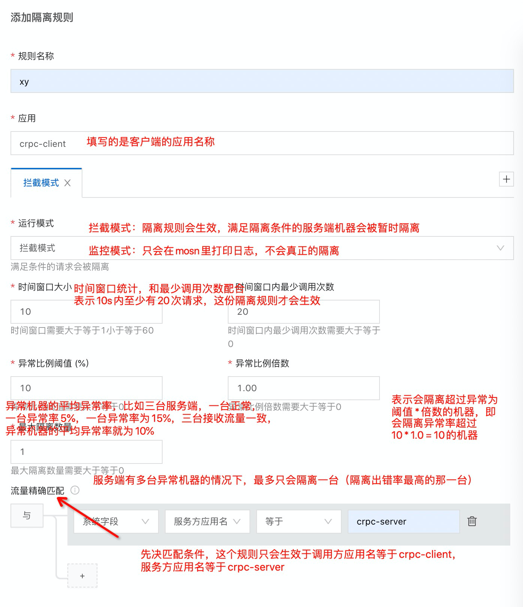
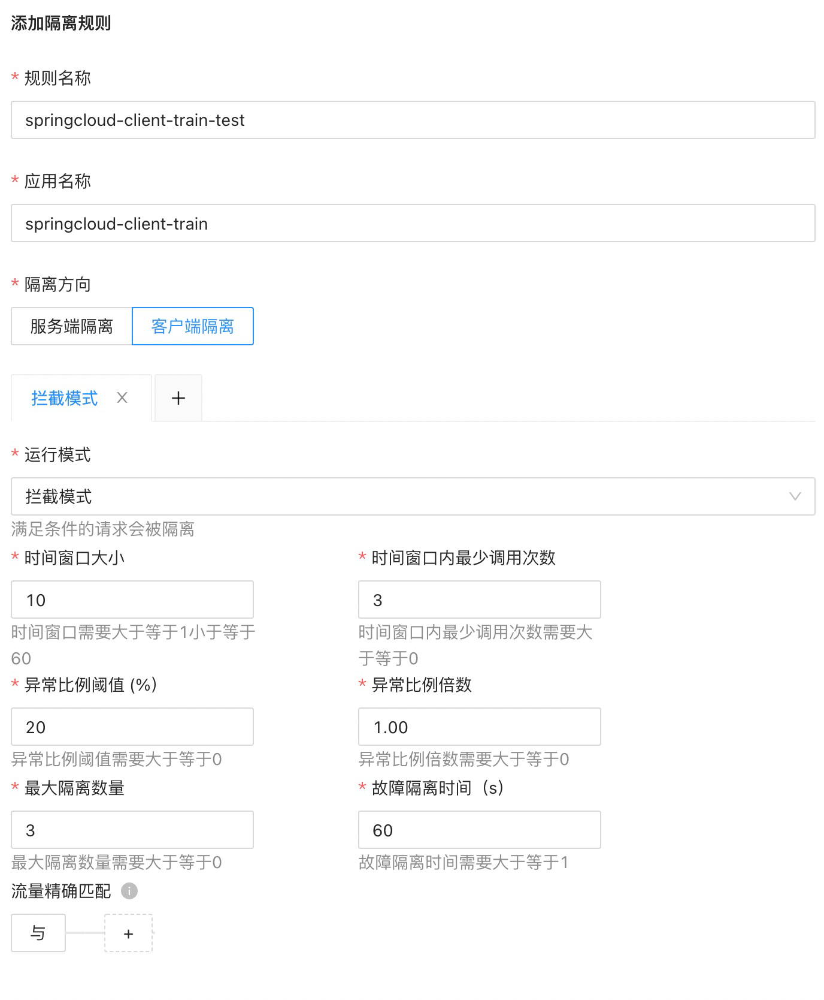
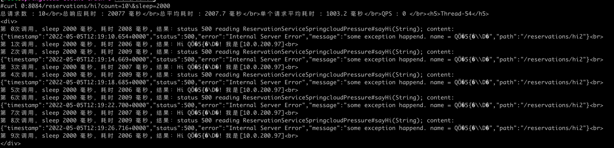
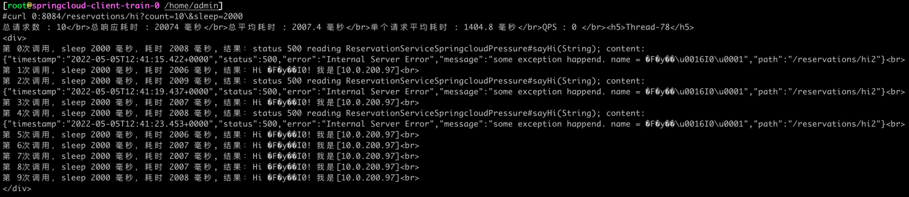
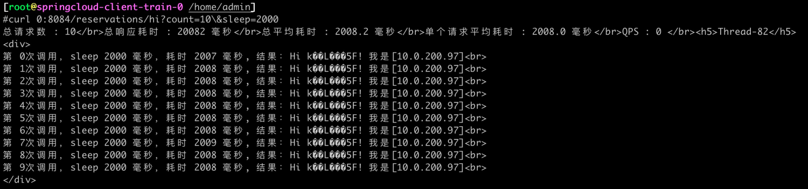

文档修订历史

| 版本号 | 作者                               | 备注     | 修订日期      |
|-----|----------------------------------| -------- |-----------|
| 0.1 | [檀少](https://github.com/Tanc010) | 初始版本 | 2022.5.10 |

<a name="FISmA"></a>
## 2.7.6 故障隔离
某个服务故障或者异常时，如果该服务触发熔断会造成整个服务的不可用。而故障隔离能够定位到异常的服务实例，实现实例级别精细化的隔离和摘流，使故障影响的范围更小、更可控。
<a name="FISmB"></a>
### 配置说明
<a name="FISmC"></a>
#### 配置故障隔离规则

1. 登录 MS控制台。
1. 在左侧菜单栏选择 **服务网格** > **服务治理**，然后单击 **服务限流 **页签**。**
1. 单击**添加限流规则**，然后配置以下参数：
   
   | **参数** | **说明** |
   | --- | --- |
   | **规则名称** | 配置故障隔离规则的名称。<br>最多支持 255 个字符。 |
   | **应用** | 填写客户端应用。 |
   | **运行模**式 | 配置故障隔离规则的运行方式，取值如下：<ul><li>**拦截模式**：故障隔离规则生效，有故障的服务器会被暂时隔离。<li>**监控模式**：有故障的服务器不会被隔离，只打印日志。
      | **时间窗口大小** | 设置故障检测的时间，与 **时间窗口内最少调用次数**配合，只有在指定时间段内进行指定次数的请求才会被采集。<br>取值范围：(1,60]<br>单位：秒 |
      | **时间窗口内最少调用次数** | 设置指定时间内的最少调用请求次数。<br>取值 ≥ 0。 |
      | **异常比例阈值（%）** | 设置异常请求的比例，配合**异常比例倍数**参数来确定是否隔离目标服务器。<br> 当异常请求的比例 ＞ **异常比例阈值**×**异常比例倍数**时，系统认为目标服务器异常，将隔离目标服务器。<br>取值范围：(0,100] |
      | **异常比例倍数** | 设置异常比例的倍数，配合**异常比例阈值**参数来确定是否隔离目标服务器。<br>取值 ≥ 0。 |
      | **最大隔**离数量 | 设置服务器的隔离数量，即多台服务器故障时最多隔离几台。<br> 取值 ≥ 0。 |
      | **流量精确匹配（可选）** | 符合流量精确匹配的流量才进行隔离。<br>可配置多条匹配规则，各匹配规则之间是与的关系。参数配置如下：<ul><li>**字段**：选择 **系统字段**。<li>**字段名**：选择 **服务方应用名**。<li>**逻辑**：包括 **等于**、**不等于**、**属于**、**不属于**、**正则**。<li>**字段值**：填入所选字段的值。

4. 单击 **提交**，然后单击 **确定**。
4. 在故障隔离规则列表中，将刚刚创建的故障隔离规则的状态改为 **开**。
<a name="FISmD"></a>
#### 配置示例
某应用有 A、B、C 三台服务器，三台服务的状态如下：

- A：正常
- B：异常，异常率 20%
- C：异常，异常率 40%

已配置的故障隔离规则如下：

- 时间窗口大小：10
- 时间窗口内最少调用次数：20
- 异常比例阈值：20
- 异常比例倍数：1
- 最大隔离数量：1

如果 10 秒内有 20 个请求，且异常率 ≥ 20%（异常比例倍数 × 异常比例阈值），会触发故障隔离规则。因为 B 的故障率更高，系统会优先将 B 隔离。此时，若将最大隔离数量调整为 2，则 A、B 均会被剔除。
<a name="FISmE"></a>
#### 编辑故障隔离规则
您可以随时编辑已创建的故障隔离规则，规则提交后实时生效。

1. 在 **故障隔离** 页签，单击目标故障隔离规则右侧的 **编辑**。
1. 按需求编辑故障隔离规则后，单击 **提交**。
<a name="FISmF"></a>
#### 删除故障隔离规则
您可以删除已创建的故障隔离规则，删除操作会实时生效，请谨慎操作。

1. 在 **故障隔离** 页签，单击目标故障隔离规则右侧的 **删除**。
1. 单击 **确定**。
<a name="FISmG"></a>
### 2.7.6.1 标准springcloud接入故障隔离能力

<a name="FISmH"></a>
#### 客户端故障隔离
故障隔离规则配置

故障隔离会隔离掉符合条件的异常的服务端实例，因此我们需要设置服务端接口出错
```powershell
kubectl exec -it springcloud-server-train-v1-0 -c mosn-sidecar-container bash

curl 0:8080/status/set?throwException=true
```
进入客户端容器，多次调用客户端接口
```shell
kubectl exec -it springcloud-client-train-0 -c mosn-sidecar-container bash

## 访问8084端口的 hi 接口
curl 0:8084/reservations/hi?count=10\&sleep=2000
```
调用springcloud-server-train-v1的请求都异常了，返回500错误。接下来我们把故障隔离规则打开。

故障隔离规则开启并且其中一台服务端异常设置后，我们可以调用客户端接口进行验证，下方的验证结果说明，前10s内调用了异常服务，10s之后异常的服务被隔离掉了。请求都打到正常的服务上了。

隔离期间关闭服务端异常，再次进行调用仍然只会调用到一台机器
```powershell
curl 0:8080/status/set?throwException=false
```

