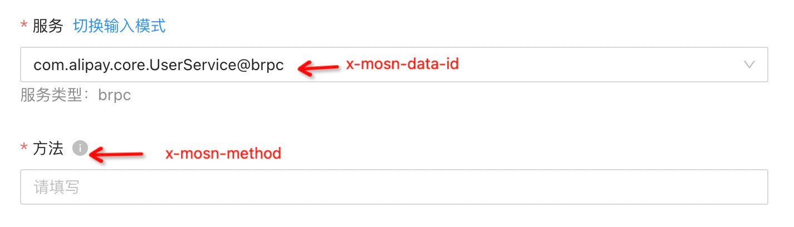
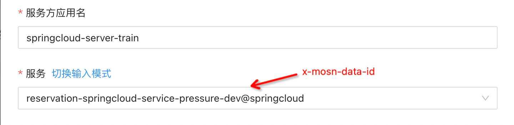
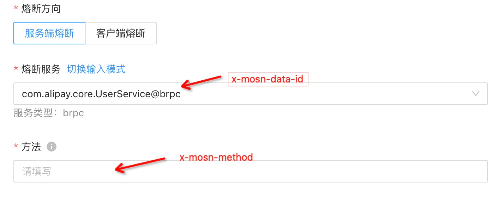
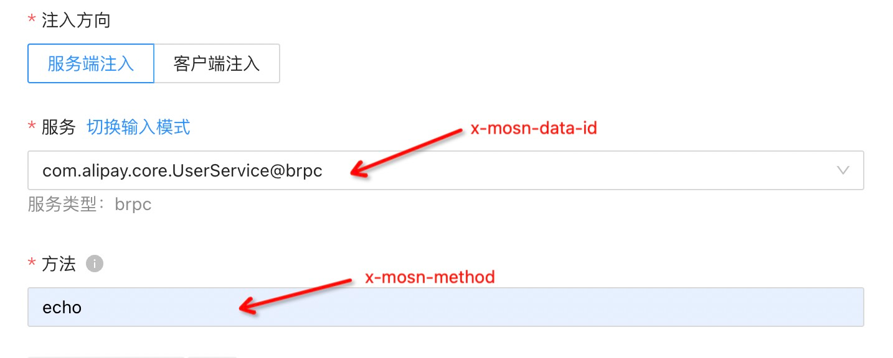

文档修订历史

| 版本号 | 作者                               | 备注     | 修订日期      |
|-----|----------------------------------| -------- |-----------|
| 0.1 | [檀少](https://github.com/Tanc010) | 初始版本 | 2022.5.10 |

<a name="LjFmL"></a>
## 2.7.7 故障隔离
服务治理资源key是服务治理相关功能依赖的关键字段，也是sidecar的系统字段，这写字段对于自定义协议显的尤为重要。以下罗列了服务治理资源key：

| **key** | **含义** | **作用** |
| --- | --- | --- |
| x-mosn-data-id | 服务标识 | 服务治理中关联某个具体的服务 |
| x-mosn-traffic-type | 压测标志 | 服务治理中区分流量类型（测试流量/正式流量） |
| x-mosn-caller-ip | 调用端IP | 服务治理根据调用端IP精准匹配流量 |
| x-mosn-target-ip | 服务端IP |
| x-mosn-caller-app | 调用端应用名 | 服务治理根据调用端应用名精准匹配流量 |
| x-mosn-target-app | 服务端应用名 | 服务治理根据服务端应用名精准匹配流量 |
| x-mosn-method | 请求函数名字 | 服务治理中关联某个服务下具体的方法 |

对于自定义的协议，需要告诉sidecar如何获取这些key，那么在自定义协议的配置metadata里就需要包含对这些服务治理资源key的声明。
### Metadata 配置的模版
```json
{
	"name": "springcloud",
	"kind": "protocol",
	"framework": "HTTP1",
	"internal": false,
	"variables": [{
			"field": "x-mosn-data-id",
			"pattern": ["${X-TARGET-APP}@springcloud"],
			"required": true
		},
		{
			"field": "x-mosn-method",
			"pattern": ["${x-mosn-method}"],
			"required": false
		},
		{
			"field": "x-mosn-caller-app",
			"pattern": ["${X-CALLER-APP}"],
			"required": false
		},
		{
			"field": "x-mosn-target-app",
			"pattern": ["${X-TARGET-APP}"],
			"required": false
		}
	],
	"dependencies": [{
		"mosn_api": "v0.0.0-20211217011300-b851d129be01",
		"mosn_pkg": "v0.0.0-20211217101631-d914102d1baf"
	}]
}

```
这里声明了包括x-mosn-data-id、x-mosn-method、x-mosn-caller-app、x-mosn-target-app的服务治理资源key。
### 服务治理拆分
#### 服务限流相关的资源key
| key | 功能 |
| --- | --- |
| x-mosn-method | |
| x-mosn-target-app | 流量精确匹配-系统字段-服务方应用名 |
| x-mosn-traffic-type | 流量精确匹配-系统字段-流量类型 |
| x-mosn-caller-app | 流量精确匹配-系统字段-调用方应用名 |
| x-mosn-caller-ip | 流量精确匹配-系统字段-调用方 IP |

这些资源key对应的配置如下：


#### 服务路由相关的资源key
| key | 功能 |
| --- | --- |
| x-mosn-target-app | 流量精确匹配-系统字段-服务方应用名 |
| x-mosn-traffic-type | 流量精确匹配-系统字段-流量类型 |
| x-mosn-caller-app | 流量精确匹配-系统字段-调用方应用名 |
| x-mosn-caller-ip | 流量精确匹配-系统字段-调用方 IP |


#### 服务熔断相关的资源key
| key | 功能 |
| --- | --- |
| x-mosn-method | |
| x-mosn-target-app | 流量精确匹配-系统字段-服务方应用名 |
| x-mosn-traffic-type | 流量精确匹配-系统字段-流量类型 |
| x-mosn-caller-app | 流量精确匹配-系统字段-调用方应用名 |
| x-mosn-caller-ip | 流量精确匹配-系统字段-调用方 IP |

这些资源key对应的配置如下：


#### 服务降级相关的资源key
| key | 功能 |
| --- | --- |
| x-mosn-method | 降级请求的方法 |

#### 故障注入相关的资源key
| key | 功能 |
| --- | --- |
| x-mosn-method | |
| x-mosn-target-app | 流量精确匹配-系统字段-服务方应用名 |
| x-mosn-traffic-type | 流量精确匹配-系统字段-流量类型  |
| x-mosn-caller-app | 流量精确匹配-系统字段-调用方应用名 |
| x-mosn-caller-ip | 流量精确匹配-系统字段-调用方 IP |

这些资源key对应的配置如下：


#### 故障隔离相关的资源key
| key | 功能(客户端功能) |
| --- | --- |
| x-mosn-target-app | 流量精确匹配-系统字段-服务方应用名 |
| x-mosn-traffic-type | 流量精确匹配-系统字段-流量类型 |
| x-mosn-caller-app | 流量精确匹配-系统字段-调用方应用名 |
| x-mosn-caller-ip | 流量精确匹配-系统字段-调用方 IP |


