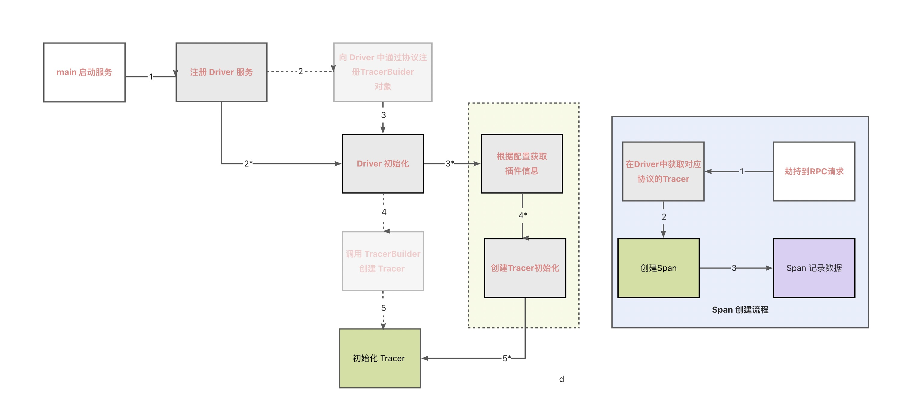

文档修订历史

| 版本号 | 作者 | 备注     | 修订日期      |
| ------ | ---- | -------- |-----------|
| 1.2 | [省善](https://github.com/YIDWang) | 初始版本 | 2023.1.1 |

### 2.8.1 trace-skywalking trace 实现
本小节主要介绍使用插件的方式接入 skywalking 标准的 trace 。

#### trace 调用流程

* 内核创建流程为 1-> 2 -> 3-> 4 -> 5
* 插件加载流程为 1-> 2*-> 3*-> 4*->5*
备注：虚线箭头表示当前协议加载 tracer 加载流程，黄色框表示插件加载流程，也是本次加在的流程

#### 设计实现
我们先展示编写完成后的目录结构
- 代码
```go
// go-plugin插件仓库根目录
plugins/traces/skywalking
└── main
├── config.go
├── driver.go
├── logger.go
├── span.go
└── tracer.go
```
- 配置
```go
// go-plugin插件仓库根目录
configs/traces/skywalking
├── config.json
└── metadata.json
```

- 实现 TracerBuilder 接口

此方法实现了创建了一个 tracer，初始化一个 Tracer 对象，其中 GetTracer 为全局共用函数。
```go
func TracerBuilder(cfg map[string]interface{}) (api.Tracer, error) {
	tracerProvider, err := GetTracer(cfg)
	if err != nil {
		return nil, err
	}
	return &skyTracer{
		cfg:            cfg,
		tracerProvider: tracerProvider,
	}, nil
}
```

- 实现 Start 方法

Tracer 对象实现 Start 方法，根据传入的协议请求类型创建对应的 Span 对象。
```go
func (tracer *skyTracer) Start(ctx context.Context, request interface{}, startTime time.Time) api.Span {
	switch req := request.(type) {
	case http.RequestHeader:
		return tracer.httpStart(ctx, req, startTime)
	case api.XFrame:
		return tracer.frameStart(ctx, req, startTime)
	}
	return trace.NewNooSpan()
}
```

- 实现 Span 方法
 下面是实现 Span 对象方法，负责一个记录一个请求的所有必要信息。

```go
func NewSpan(ctx context.Context, startTime time.Time, provider *go2sky.Tracer) *SkySpan {
	h := &SkySpan{
		startTime: startTime,
		ctx:       ctx,
		provider:  provider,
		kvs:       make([]kv, 0, 10),
	}
	return h
}

func (h *SkySpan) TraceId() string {
	return h.tid
}

func (h *SkySpan) SpanId() string {
	return h.sid
}

func (h *SkySpan) ParentSpanId() string {
	return h.psid
}

func (h *SkySpan) InjectContext(headers api.HeaderMap, reqInfo api.RequestInfo) {
	upstreamLocalAddress := reqInfo.UpstreamLocalAddress()
	if header, ok := headers.(http.RequestHeader); ok {
		requestURI := string(header.RequestURI())
		url := strings.Join([]string{"http://", upstreamLocalAddress, requestURI}, "")
		h.kvs = append(h.kvs, kv{string(go2sky.TagURL), url})
		h.kvs = append(h.kvs, kv{string(go2sky.TagHTTPMethod), string(header.Method())})
		h.operationName = requestURI
		exit, err := h.provider.CreateExitSpan(h.entryctx, requestURI, upstreamLocalAddress, func(Value string) error {
			headers.Set(propagation.Header, Value)
			return nil
		})
		if err != nil {
			log.DefaultLogger.Errorf("[SkyWalking] [tracer] [http1] create exit span error, err: %v", err)
			return
		}
		exit.SetComponent(MOSNComponentID)
		exit.SetSpanLayer(language_agent.SpanLayer_Http)
		h.exitSpan = exit
	} else {
		exit, err := h.provider.CreateExitSpan(h.entryctx, "mosn", upstreamLocalAddress, func(Value string) error {
			headers.Set(propagation.Header, Value)
			return nil
		})
		if err != nil {
			log.DefaultLogger.Errorf("[SkyWalking] [tracer] [http1] create exit span error, err: %v", err)
			return
		}
		exit.SetComponent(MOSNComponentID)
		exit.SetSpanLayer(language_agent.SpanLayer_RPCFramework)
		h.exitSpan = exit
	}
}

func (h *SkySpan) SetRequestInfo(reqInfo api.RequestInfo) {
	h.setRequestInfo(reqInfo)
	responseCode := strconv.Itoa(reqInfo.ResponseCode())

	// end exit span (upstream)
	if h.exitSpan != nil {
		exit := h.exitSpan
		if reqInfo.ResponseCode() != api.SuccessCode {
			ok := reqInfo.GetResponseFlag(trace.MosnProcessFailedFlags)
			exit.Tag(go2sky.TagStatusCode, strconv.Itoa(reqInfo.ResponseCode()))
			if ok {
				exit.Error(time.Now(), "mosn error")
			} else {
				exit.Error(time.Now(), "biz error")
			}
		} else {
			exit.Tag(go2sky.TagStatusCode, responseCode)
		}
		kvs := h.ParseVariable(h.ctx)
		h.addTag(exit, kvs)
		exit.SetOperationName(h.operationName)
		exit.End()
		h.log(kvs, go2sky.SpanTypeExit)
	}

	// entry span (downstream)
	entry := h.entrySpan
	if reqInfo.ResponseCode() != api.SuccessCode {
		ok := reqInfo.GetResponseFlag(trace.MosnProcessFailedFlags)
		entry.Tag(go2sky.TagStatusCode, strconv.Itoa(reqInfo.ResponseCode()))
		if ok {
			h.entrySpan.Error(time.Now(), "mosn error")
		} else {
			h.entrySpan.Error(time.Now(), "biz error")
		}
	} else {
		entry.Tag(go2sky.TagStatusCode, responseCode)
	}
}

func (h *SkySpan) setRequestInfo(reqInfo api.RequestInfo) {
	if host := reqInfo.UpstreamHost(); host != nil {
		h.kvs = append(h.kvs, kv{"upstream.address", host.AddressString()})
	}
	if addr := reqInfo.DownstreamRemoteAddress(); addr != nil {
		h.kvs = append(h.kvs, kv{"downstream.address", addr.String()})
	}
	h.kvs = append(h.kvs, kv{"request.size", strconv.Itoa(int(reqInfo.BytesReceived()))})
	h.kvs = append(h.kvs, kv{"respone.size", strconv.Itoa(int(reqInfo.BytesSent()))})
	h.kvs = append(h.kvs, kv{"duration", strconv.Itoa(int(reqInfo.Duration().Nanoseconds()))})
	process := reqInfo.ProcessTimeDuration().Nanoseconds()
	if process == 0 {
		process = reqInfo.RequestFinishedDuration().Nanoseconds()
	}
	h.kvs = append(h.kvs, kv{"mosn.process.duration", strconv.Itoa(int(process))})
	h.kvs = append(h.kvs, kv{"mosn.process.request.duration", strconv.Itoa(int(reqInfo.RequestFinishedDuration().Nanoseconds()))})
	h.kvs = append(h.kvs, kv{"mosn.process.respone.duration", strconv.Itoa(int(reqInfo.ResponseReceivedDuration().Nanoseconds()))})
	if reqInfo.ResponseCode() != api.SuccessCode {
		ok := reqInfo.GetResponseFlag(trace.MosnProcessFailedFlags)
		h.kvs = append(h.kvs, kv{"mosn.process.fail", strconv.FormatBool(ok)})
	}
}

func (h *SkySpan) FinishSpan() {
	if h.entrySpan != nil {
		kvs := h.ParseVariable(h.ctx)
		h.addTag(h.entrySpan, kvs)
		h.entrySpan.SetOperationName(h.operationName)
		currentIP, _ := trace.GetOutboundIP()
		h.entrySpan.SetPeer(currentIP)
		h.entrySpan.End()
		h.log(kvs, go2sky.SpanTypeEntry)
	}
}

func (h *SkySpan) addTag(span go2sky.Span, kvs []kv) {
	for _, kv := range kvs {
		span.Tag(go2sky.Tag(kv.Key), kv.Value)
	}
}

func (h *SkySpan) SetOperation(operation string) {
	h.operationName = operation
}

func (h *SkySpan) log(kvs []kv, stype go2sky.SpanType) {
	if log.DefaultLogger.GetLogLevel() >= log.DEBUG {
		kvs, _ := json.Marshal(h.kvs)
		log.DefaultLogger.Debugf("trace:%s pid:%s parentid:%s operationName:%s,kvs:%s", h.tid, h.sid, h.psid, h.operationName, kvs)
	}
}

func (h *SkySpan) CreateLocalHttpSpan(ctx context.Context, header http.RequestHeader, entry go2sky.Span) {
	h.entryctx = ctx
	h.entrySpan = entry
	h.tid = go2sky.TraceID(ctx)
	requestURI := string(header.RequestURI())
	url := strings.Join([]string{"http://", string(header.Host()), string(header.RequestURI())}, "")
	h.kvs = append(h.kvs, kv{"caller.url", url})
	h.kvs = append(h.kvs, kv{"caller.method", string(header.Method())})
	h.operationName = requestURI
}

func (h *SkySpan) CreateLocalRpcSpan(ctx context.Context, entry go2sky.Span) {
	h.entryctx = ctx
	h.entrySpan = entry
	h.tid = go2sky.TraceID(ctx)
}

func (h *SkySpan) ParseVariable(ctx context.Context) []kv {
	kvs := make([]kv, len(h.kvs))
	copy(kvs, h.kvs)
	dp, _ := config.GetDownstreamProtocol(h.ctx)
	if len(dp) != 0 {
		kvs = append(kvs, kv{"downstream.protocol", string(dp)})
	}
	up, _ := config.GetUpstreamProtocol(h.ctx)
	if len(up) != 0 {
		kvs = append(kvs, kv{"upstream.protocol", string(up)})
	} else {
		kvs = append(kvs, kv{"upstream.protocol", string(dp)})
	}

	return kvs
}
```

- 启动配置填充
```json
{
    "reporter": "gRPC",
    "backend_service": "${SKY_WALKING_ADDRESS}",
    "service_name": "${APPNAME}",
    "max_send_queue_size":"${MAX_SEND_QUEUE_SIZE}",
    "mosn_generator_span_enabled" :"${MOSN_GENERATOR_SAPN_ENABLED}",
    "vmmode":"${VMMODE}",
    "pod_name":"${POD_NAME}"
}
```

- metadata.json 配置填充
```json 
{
    "name" : "skywalking",
    "kind": "trace",             
    "dependencies": [{
      "mosn_api": "v0.0.0-20211217011300-b851d129be01",
      "mosn_pkg": "v0.0.0-20211217101631-d914102d1baf"
    }]
}
```

#### 功能验证
- 编译插件
```shell
make trace plugin=skywalking 
```

- 插件打包
```shell
 make pkg-trace plugin=skywalking
```

- mosn 启动
```shell
make start
```

- skywalking 启动
```shell
cd etc/docker-compose/skywalking 
docker-compose up -d  
```

- 加载成功日志
```shell
```
- 发送 RPC 请求

- 查看 trace 日志