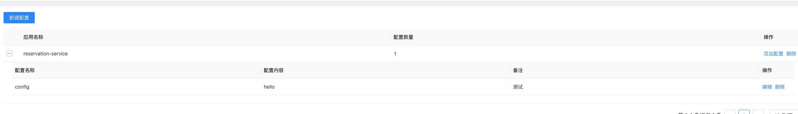
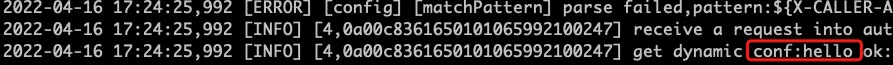

文档修订历史

| 版本号 | 作者 | 备注    | 修订日期     |
|-----| ---- |-------|----------|
| 0.1 | [省善](https://github.com/YIDWang) | 初始版本 | 2022.4.10 |

# 3. 动态配置
开源 mosn 配置实现主要通过两种渠道：服务启动配置文件，机器环境变量，目前可以满足大多数场景。有些场景下，业务期望进程不重启的情况下，配置动态变更，因此插件支持了动态配置感知功能并基于封装API。目前已经支持全局配置变更，未来会支持更多功能。

## 3.1 全局配置 
目前提供了两个 API 函数供开发使用，鉴于全局配置众多因此是通过 key:value 保存在 map 中，以 key 为最小纬度管理。

### 3.1.1 API 使用指南
* GlobalExtendMapByContext : 从 ctx 中获取全局全部配置 map 对象。
* GlobalExtendConfigByContext : 通过 ctx 和 key 获取全局配置中的某个 value 数据。 

```shell
func GlobalExtendMapByContext(ctx context.Context) (*sync.Map, bool) {
	cfg, ok := ctx.Value(ExtendConfigKey).(*sync.Map)
	return cfg, ok
}

func GlobalExtendConfigByContext(ctx context.Context, key string) (string, bool) {
	cfg, ok := GlobalExtendMapByContext(ctx)
	if !ok {
		return "", false
	}
	info, ok := cfg.Load(key)
	if !ok {
		return "", false
	}
	sinfo, ok := info.(string)
	return sinfo, ok
}
```

#### 服务控制台---配置下发
选择对应的 appname, 填写对应的 key 值 即可完成下发。


### 3.1.2 实践
* http协议进行请求头部修改，在拦截器插件中解析动态配置获取 dynamic_key 值，分别在请求和响应头增加字段：
  * 请求头部 增加 x-request-proxy: ${value}
  * 响应头部 增加 x-response-proxy: ${value}
  
控制台下发配置如下：

|  key | value|
|  ----  | ----  |
|config|hello world|

```go
	conf, ok := config.GlobalExtendConfigByContext(ctx, "config")
	log.DefaultContextLogger.Infof(ctx, "get dynamic conf:%s ok:%s", conf, ok)
```
* 插件打包
```shell
make filter plugin=dynamic_conf
make pkg-filter plugin=dynamic_conf
```
* 插件上传

* 发请求(当前绑定的 springcloud 服务)
```bash
curl  localhost:10080
```
* 查看日志
```shell
grep 'get dynamic conf' /home/admin/logs/mosn/default.log
```


### 3.1.3 FAQ
* 配置下发成功
```go
	log.DefaultLogger.Infof("[xprotocol] [config] receive dataId:%s value:%s content:%v", dataId, value, ec.content)
```
* 配置解析失败
```go
    log.DefaultLogger.Errorf("[xprotocol] [config] receive dataId:%s value:%s err:%s", dataId, value, err)
```
